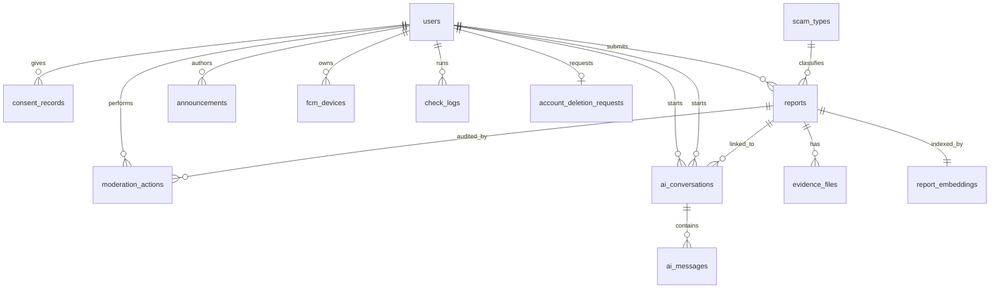

# Scam Report Platform — Database Design

| | |
|---|---|
| **Document Version** | 1.6 |
| **Status** | Draft — for team review |
| **Date issued** | 2026-05-12 |
| **Derived from** | PRD v1.3 (2026-05-01), BRD v2.0 (2026-04-23) |
| **Target backend** | Supabase Postgres 15 + `pgvector` (system of record), Firebase Cloud Firestore (read-only mirror for `alerts` + `my-reports`) |

> **Scope of this document:** schema design (tables, columns, types, constraints, indexes, RLS posture, retention rules) sufficient to start Sprint 1 backend work. SQL migrations are separate deliverables.

> **Polyglot persistence note:** Postgres remains the system of record for **all** tables in this document. Firestore mirrors **only** two read surfaces — `alerts` (announcements) and `my-reports/{uid}/items` (per-user submission history) — to provide offline-first reads and real-time listener UI on mobile. Firestore is never authoritative; on any divergence Postgres wins. Mirror writes are server-only (admin SDK), never from the client. See `docs/architecture.md` "Firestore mirror" section for the sync worker shape and `firestore.rules` for the security policy.

---

## 0. What Changed

### v1.7 (2026-05-15)

| Area | v1.6 | v1.7 | Why |
|---|---|---|---|
| Scammer profile | Offender attributes (`target_identifier*`) inlined on every `reports` row | Added `scammers` + `scammer_identifiers` tables; `reports.scammer_id` (nullable FK) | Separates offender from incident so AI score / Ask AI / verdict pipeline can aggregate by scammer. `target_identifier*` columns kept as denormalised cache. |
| AI accuracy measurement | No labelled eval surface | Added `ai_eval_cases` / `ai_eval_runs` / `ai_eval_results` | Enables `POST /admin/ai-eval/run` to compute verdict accuracy, scammer recall@1, MRR, missing-facts F1, p95 latency, and trend run-to-run. |

### v1.6 (2026-05-12)

| Area | v1.5 | v1.6 | Why |
|---|---|---|---|
| Announcement attachments | Announcements text-only | Added `announcement_attachments` table | Mirror evidence-file pattern for announcement images/PDFs (Supabase Storage bytes, DB metadata). |
| Account-deletion review workflow | Worker-only purge (`pending → purged`) | Added `status` (`deletion_request_status` enum), `reviewed_at`, `reviewed_by_admin_id`, `rejection_reason` on `account_deletion_requests` | Admin moderation of deletion requests before purge worker runs. |
| `reports.ai_score` / `ai_confidence` | Computed on-demand inside admin detail handler | Persisted at submit time (still nullable for legacy rows + Gemini failures) | Avoid recomputing on every admin detail load; preserve triage hint across queue restarts. See `apps/api/src/core/ai-score/`. |

### v1.5 (2026-05-10)

| Area | v1.4 | v1.5 | Why |
|---|---|---|---|
| Ask AI draft persistence | Drafts client-only | Added `ai_conversations.draft_state` (JSONB) | Cross-device sync of in-progress AI-drafted report. Shape `AskAiPersistedDraft` in `packages/shared/src/schemas/ask-ai.ts`. `evidenceAttachmentIds` inside the JSON references existing `ai_message_attachments.id` rows; raw bytes never stored in this column. |

### v1.4 (2026-05-01)

| Area | v1.3 | v1.4 | Why |
|---|---|---|---|
| Ask AI attachments | No attachment support on `ai_messages` | Added `ai_message_attachments` table | PRD v1.3 FR-4.2: Gemini multimodal — users can attach screenshots/PDFs to Ask AI chat |

### v1.3 (2026-05-01)

| Area | v1.2 | v1.3 | Why |
|---|---|---|---|
| Ask AI schema | `search_queries` table (one row per semantic search) | Replaced by `ai_conversations` + `ai_messages` | PRD v1.3 §3.3: AI Search replaced by conversational Ask AI with reporting-intent detection. |
| Regional tagging | OQ-3 open ("out of scope this release, may revisit") | **Permanently dropped.** No `province_code`, no `provinces` table. | PRD v1.3 §7. |

### v1.2 (2026-04-28)

| Area | v1.1 | v1.2 | Why |
|---|---|---|---|
| Polyglot persistence | Postgres only | Postgres + Firestore mirror (read-only, `alerts` + `my-reports/{uid}/items`) | PRD v1.2 §6.5: offline-first reads + real-time listeners for two surfaces. Postgres still authoritative; **no schema change** to Postgres. |
| Reporter visibility in admin payloads | Reporter ID present in `/admin/*` responses | Reporter fields stripped server-side from all `/admin/*` and `/mod/*` responses | PRD v1.2 FR-7.4 + FR-7.8 / OQ-1 resolution. **No schema change** — `reports.reporter_user_id` stays for legal traceability; only the API serializer changes. |
| Web platform | none | Flutter Web public surface (verdict, feed, alerts, login). No DB surface change — same Postgres reads, no Firestore writes from web | PRD v1.2 §6.6. |
| Open questions | OQ-1..5 open | OQ-1, OQ-3, OQ-4, OQ-5 resolved; OQ-2 still open | PRD v1.2 §8. |

### v1.1 (2026-04-26)

| Area | v1.0 | v1.1 | Why |
|---|---|---|---|
| Topic subscriptions | `notification_topics` + `user_topic_subscriptions` tables | **Removed** | PRD §3.8 / FR-10.2: push is now automatic and scoped to two cases; no user-configurable topics. |
| FCM device platform | `device_platform` enum (`'android' \| 'ios'`) | **Enum dropped, column dropped** | PRD §6.6 / §7: Android is the only supported platform. |
| OAuth providers | "Google, Apple" referenced | Google only | FR-1.1 in PRD v1.1. No schema change — auth lives in Firebase — but documented for reviewers. |
| Reporter-facing status | 4 statuses surfaced (Pending / Verified / Rejected / Flagged) | 3 statuses surfaced (Pending / Verified / Rejected); `flagged` is admin-internal | FR-6.1. **No schema change** — `report_status` still has `flagged`; the API now maps `flagged → 'pending'` when responding to the reporter. |
| Open-question impact table | OQ-1 through OQ-7 | OQ-1 through OQ-5 (OQ-6, OQ-7 closed) | PRD v1.1 closes the two questions whose schema landing was already settled. |

Everything else — `users`, `reports`, `evidence_files`, `moderation_actions`, `report_embeddings`, `announcements`, `check_logs`, `consent_records`, `account_deletion_requests` — is unchanged from v1.0.

---

## 1. Tech Stack Assumptions

These are inferred from the PRD (§6.2, §6.3, §3.3, §3.8) and from the repo's stated stack:

- **Database:** PostgreSQL on Supabase
- **Extensions required:** `pgvector` (RAG semantic search), `pgcrypto` (UUID + hashing), `citext` (case-insensitive identifiers)
- **Authentication:** Firebase Authentication via email+password and Google OAuth (FR-1.1). The app sends Firebase ID tokens; the backend verifies them and maps `firebase_uid` → an internal `users.id`. Supabase Auth is **not** used — RLS policies must read the verified Firebase UID from a request claim/header set by the backend, not from `auth.uid()`.
- **Object storage:** Supabase Storage bucket `evidence/` with RLS; files served via signed, time-limited URLs.
- **Embeddings:** Gemini `gemini-embedding-001` → **vector(768)**. If the team picks a different model, only the column dimension changes. (Pre-2026-05-12 this said `text-embedding-004`; the code uses `gemini-embedding-001` — see `apps/api/src/core/gemini/client.ts`.)
- **Push:** FCM, sent server-side. Two trigger cases only (FR-8.3, FR-8.4):
  - On report status transition to `verified` or `rejected` → push to reporter's devices.
  - On announcement publish → push to **all** registered users' devices.
  - There is no per-user notification preference table; the backend either iterates `fcm_devices` rows or uses a single hardcoded server-managed FCM topic (e.g. `all_announcements`) that users cannot see or opt out of in this release.

---

## 2. Entity-Relationship Overview



The model now has four logical clusters (down from five — the topic-subscription cluster is gone):

1. **Identity & consent** — `users`, `consent_records`, `account_deletion_requests`
2. **Content** — `reports`, `evidence_files`, `scam_types`, `report_embeddings`, `announcements`
3. **Moderation, communications & analytics** — `moderation_actions`, `fcm_devices`, `check_logs`
4. **Ask AI** — `ai_conversations`, `ai_messages`, `ai_message_attachments`

---

## 3. Enumerated Types

```sql
CREATE TYPE user_role         AS ENUM ('user', 'admin');
CREATE TYPE preferred_lang    AS ENUM ('th', 'en');
CREATE TYPE report_status     AS ENUM ('pending', 'verified', 'rejected', 'flagged', 'withdrawn');
CREATE TYPE identifier_kind   AS ENUM ('phone', 'url', 'other');
CREATE TYPE evidence_kind     AS ENUM ('image', 'pdf');
CREATE TYPE moderation_action AS ENUM ('approve', 'reject', 'flag', 'unflag');
CREATE TYPE verdict_label     AS ENUM ('scam', 'suspicious', 'safe', 'unknown');
CREATE TYPE check_input_kind  AS ENUM ('phone', 'url', 'text');
CREATE TYPE announcement_cat  AS ENUM ('fraud_alert', 'tips', 'platform_update');
CREATE TYPE announcement_stat AS ENUM ('draft', 'published', 'unpublished');
CREATE TYPE consent_kind      AS ENUM ('registration', 'first_report_submission', 'privacy_policy', 'terms_of_service');
CREATE TYPE deletion_request_status AS ENUM ('pending', 'approved', 'rejected');
-- device_platform enum REMOVED in v1.1 (Android-only release).
```

`report_status` retains all five values:
- `pending`, `verified`, `rejected` are reporter-visible (FR-6.1).
- `flagged` is **admin-internal**: a report in this state is shown to the reporter as `pending`. The API enforces this mapping on every reporter-facing response.
- `withdrawn` models FR-5.5 (user withdraws a Pending report) without deleting the row.

---

## 4. Tables

### 4.1 `users`

The internal user profile. One row per Firebase account.

| Column | Type | Notes |
|---|---|---|
| `id` | `uuid` PK, default `gen_random_uuid()` | Internal stable ID; foreign keys point here, not at `firebase_uid`. |
| `firebase_uid` | `text` UNIQUE NOT NULL | Verified Firebase subject. Indexed. |
| `email` | `citext` UNIQUE | Cached from Firebase claims. |
| `display_name` | `text` | Optional, nullable. |
| `role` | `user_role` NOT NULL DEFAULT `'user'` | Promoted to `'admin'` manually (PRD §2). |
| `preferred_language` | `preferred_lang` NOT NULL DEFAULT `'th'` | FR-10.2; default Thai per §6.4. |
| `created_at` | `timestamptz` NOT NULL DEFAULT `now()` | |
| `updated_at` | `timestamptz` NOT NULL DEFAULT `now()` | Maintained by trigger. |
| `deleted_at` | `timestamptz` | Soft-delete marker (FR-1.5). Hard purge happens via `account_deletion_requests` worker after 7 days. |

**Indexes:** `firebase_uid` (unique), `role` (partial WHERE role = 'admin'), `lower(email)`.

**RLS posture:**
- A user can `SELECT` only their own row (`firebase_uid = current_firebase_uid()`).
- Admins can `SELECT` any row.
- `INSERT` / `UPDATE` go through the backend service role; clients never write directly.

> **Note on notification preferences:** there are no notification-related columns on `users` because PRD v1.1 (FR-10.2) explicitly removes user-configurable push controls. If the product later adds opt-outs, the natural place would be a `user_notification_prefs` table, not new columns here.

### 4.2 `consent_records`

Append-only PDPA consent log (§6.3). Each consent acceptance is a new row — never updated, never deleted, even after account deletion.

| Column | Type | Notes |
|---|---|---|
| `id` | `uuid` PK | |
| `user_id` | `uuid` FK → `users(id)` ON DELETE SET NULL | Nullable so consent survives account deletion. |
| `consent_type` | `consent_kind` NOT NULL | |
| `policy_version` | `text` NOT NULL | E.g. `'privacy-1.0'`. |
| `accepted_at` | `timestamptz` NOT NULL DEFAULT `now()` | |
| `ip_address` | `inet` | Optional. |
| `user_agent` | `text` | Optional. |

Two consent points (registration + first report) map directly to FR-1.2 / FR-5.3.

### 4.3 `scam_types`

Reference table for the fixed taxonomy (PRD §3.4). Kept in a table, not an ENUM, so admins can extend the list without a migration.

| Column | Type | Notes |
|---|---|---|
| `id` | `smallint` PK | |
| `code` | `text` UNIQUE NOT NULL | Stable slug, e.g. `'phone_impersonation'`. |
| `label_en` | `text` NOT NULL | |
| `label_th` | `text` NOT NULL | |
| `is_active` | `boolean` NOT NULL DEFAULT `true` | Soft-disable preserves historical reports. |
| `display_order` | `smallint` NOT NULL DEFAULT `0` | |

**Seed values:** `phone_impersonation`, `phishing_sms`, `fake_qr`, `ecommerce_fraud`, `other`.

### 4.4 `reports`

The central content table.

| Column | Type | Notes |
|---|---|---|
| `id` | `uuid` PK | |
| `reporter_id` | `uuid` FK → `users(id)` ON DELETE SET NULL | Nullable so reports survive reporter account deletion (PRD §6.3). |
| `title` | `text` NOT NULL CHECK (`length(title) BETWEEN 3 AND 200`) | FR-5.1. |
| `description` | `text` NOT NULL CHECK (`length(description) >= 10`) | FR-5.1. |
| `scam_type_id` | `smallint` FK → `scam_types(id)` NOT NULL | |
| `target_identifier` | `text` | Optional — the original string the user typed. |
| `target_identifier_kind` | `identifier_kind` | NULL when no identifier. |
| `target_identifier_normalized` | `citext` | Backend normalises (E.164 for phone, hostname-stripped lowercase URL). The verdict-check joins on this. |
| `status` | `report_status` NOT NULL DEFAULT `'pending'` | See note below on `flagged`. |
| `priority_flag` | `boolean` NOT NULL DEFAULT `false` | Lets admins/system rules bump a report to the top of the queue (FR-7.1). |
| `rejection_remark` | `text` | Populated on Reject; visible to the reporter (FR-6.2). Internal flag remarks are **never** stored here — see §4.6. |
| `ai_score` | `int` CHECK (`ai_score IS NULL OR ai_score BETWEEN 0 AND 100`) | Triage hint computed at submit time via Gemini + pgvector. Null when no verified embeddings exist yet or Gemini failed (legacy rows stay null forever — the admin UI hides the AI badge in that case). See `apps/api/src/core/ai-score/`. |
| `ai_confidence` | `text` | Confidence tier: `high` / `medium` / `low` / `unknown`. Kept as `text` rather than a Postgres enum because the union lives in `packages/shared/src/schemas/admin-reports.ts` — single source of truth across api + mobile. |
| `created_at` | `timestamptz` NOT NULL DEFAULT `now()` | |
| `updated_at` | `timestamptz` NOT NULL DEFAULT `now()` | |
| `verified_at` | `timestamptz` | Set on transition to `verified`. Powers feed sort and "reports this week" stat (FR-3.2). |

**The `flagged` status is admin-only state.** Per FR-6.1 the reporter sees these as `pending`. The My Reports query does this mapping in the API layer:

```sql
-- My Reports query
SELECT id, title, scam_type_id,
       CASE WHEN status = 'flagged' THEN 'pending' ELSE status END AS reporter_status,
       rejection_remark,
       created_at, updated_at, verified_at
FROM reports
WHERE reporter_id = current_user_id()
  AND status <> 'withdrawn';
```

**Indexes:**
- `(status, created_at DESC)` — moderation queue (admin sees real status, including `flagged`).
- `(status, verified_at DESC)` WHERE `status = 'verified'` — public feed.
- `(reporter_id, created_at DESC)` — My Reports.
- `(target_identifier_normalized)` WHERE `status = 'verified'` — verdict-check lookup.
- `(scam_type_id, verified_at DESC)` WHERE `status = 'verified'` — feed filter.

**Edit/withdraw window (FR-5.5):** `UPDATE` policy permits `reporter_id = current_user_id()` only when `status = 'pending'`. Crucially, the policy checks `'pending'` literally — a `flagged` report is **not** editable by the reporter even though they see it labelled "Pending." This is intentional: an admin has begun reviewing it.

### 4.5 `evidence_files`

Up to 5 files per report (FR-5.1). Bytes live in Supabase Storage.

| Column | Type | Notes |
|---|---|---|
| `id` | `uuid` PK | |
| `report_id` | `uuid` FK → `reports(id)` ON DELETE CASCADE | |
| `storage_path` | `text` NOT NULL UNIQUE | E.g. `reports/{report_id}/{uuid}.jpg`. |
| `kind` | `evidence_kind` NOT NULL | |
| `mime_type` | `text` NOT NULL | |
| `size_bytes` | `bigint` NOT NULL CHECK (`size_bytes > 0`) | |
| `uploaded_at` | `timestamptz` NOT NULL DEFAULT `now()` | |

**5-files-per-report rule** enforced via a `BEFORE INSERT` trigger.

**Storage RLS:** bucket policy must (a) require an authenticated request, (b) allow signed-URL `SELECT` of verified-report evidence to any authenticated user, (c) allow `SELECT` of pending/rejected/flagged evidence only to the reporter and admins.

### 4.6 `moderation_actions`

Immutable audit log (FR-7.6). Append-only — no `UPDATE` or `DELETE` policy is granted to anyone, including admins. Visible to admins via the report detail screen; never exposed publicly.

| Column | Type | Notes |
|---|---|---|
| `id` | `uuid` PK | |
| `report_id` | `uuid` FK → `reports(id)` ON DELETE RESTRICT | A report with audit history must not be hard-deleted; soft-mark it instead. |
| `admin_id` | `uuid` FK → `users(id)` ON DELETE SET NULL | Audit log survives admin account deletion. |
| `action` | `moderation_action` NOT NULL | |
| `remark` | `text` NOT NULL | Required for every action (FR-7.3). For `flag`, this is the team-discussion note that must **never** reach the reporter — kept here, not on `reports`. |
| `created_at` | `timestamptz` NOT NULL DEFAULT `now()` | |

**Index:** `(report_id, created_at DESC)`.

**Trigger duty:** on each `INSERT`, also update `reports.status` and (for Reject) copy `remark` into `reports.rejection_remark`. **For `approve` and `reject`, the same trigger enqueues an FCM push job for the reporter (FR-8.3).** This keeps push delivery tied to the source-of-truth state transition.

### 4.7 `report_embeddings`

One row per report, holding the Gemini-generated vector for AI semantic search (FR-4.2).

| Column | Type | Notes |
|---|---|---|
| `report_id` | `uuid` PK FK → `reports(id)` ON DELETE CASCADE | 1:1 with reports. |
| `embedding` | `vector(768)` NOT NULL | Gemini `gemini-embedding-001` dimension. |
| `content_hash` | `text` NOT NULL | SHA-256 of `title \|\| description`. Skip re-embedding when content hasn't changed. |
| `model_version` | `text` NOT NULL | E.g. `'gemini-embedding-001'`. |
| `updated_at` | `timestamptz` NOT NULL DEFAULT `now()` | |

**Index:** `USING ivfflat (embedding vector_cosine_ops) WITH (lists = 100)` — switch to `hnsw` once the dataset grows past ~10k rows.

**Population:** an after-insert/after-update trigger on `reports` enqueues an embedding job. Embeddings are only generated for `status = 'verified'` reports — FR-4.2 returns reports, and only verified reports are public.

### 4.8 `announcements`

Admin-published communications (PRD §3.7).

| Column | Type | Notes |
|---|---|---|
| `id` | `uuid` PK | |
| `author_id` | `uuid` FK → `users(id)` ON DELETE SET NULL | Must be `admin` at write time (enforced by RLS / app layer). |
| `slug` | `text` UNIQUE NOT NULL | Shareable URL (FR-8.2). |
| `title` | `text` NOT NULL | |
| `body` | `text` NOT NULL | Markdown. |
| `category` | `announcement_cat` NOT NULL | |
| `status` | `announcement_stat` NOT NULL DEFAULT `'draft'` | |
| `pushed_to_fcm_at` | `timestamptz` | Set when the FCM broadcast fires (FR-8.4); prevents accidental double-pushes if an admin re-publishes. |
| `published_at` | `timestamptz` | |
| `created_at` | `timestamptz` NOT NULL DEFAULT `now()` | |
| `updated_at` | `timestamptz` NOT NULL DEFAULT `now()` | |

**Index:** `(status, published_at DESC)` WHERE `status = 'published'`.

**Trigger duty:** on transition to `published` AND `pushed_to_fcm_at IS NULL`, enqueue a broadcast FCM job that targets every active row in `fcm_devices`, then sets `pushed_to_fcm_at = now()`.

### 4.8.1 `announcement_attachments`

Optional image / PDF attachments on an announcement. Mirrors the `evidence_files` shape but scoped to announcements. Bytes live in Supabase Storage.

| Column | Type | Notes |
|---|---|---|
| `id` | `uuid` PK, default `gen_random_uuid()` | |
| `announcement_id` | `uuid` FK → `announcements(id)` ON DELETE CASCADE | |
| `storage_path` | `text` NOT NULL | E.g. `announcements/{announcement_id}/{uuid}.jpg`. |
| `kind` | `text` NOT NULL | Free-form (`image` / `pdf`); not enum-constrained yet — promote to `evidence_kind` if reused. |
| `mime_type` | `text` NOT NULL | |
| `size_bytes` | `bigint` NOT NULL | |
| `sort_order` | `integer` NOT NULL DEFAULT `0` | Author-controlled display order. |
| `created_at` | `timestamptz` NOT NULL DEFAULT `now()` | |

**No 5-files cap trigger** — admins author announcements and the limit is enforced at the API layer.

**Storage RLS:** bucket policy allows authenticated `SELECT` via signed URL for any published announcement; admins additionally see drafts.

### 4.9 `fcm_devices`

Per-device push tokens (a user may have multiple Android devices).

| Column | Type | Notes |
|---|---|---|
| `id` | `uuid` PK | |
| `user_id` | `uuid` FK → `users(id)` ON DELETE CASCADE | |
| `fcm_token` | `text` UNIQUE NOT NULL | |
| `app_version` | `text` | For debugging. |
| `last_seen_at` | `timestamptz` NOT NULL DEFAULT `now()` | Tokens unused for 60 days are pruned by a scheduled job. |

**Changed in v1.1:** the `platform` column and `device_platform` enum were dropped — Android is the only platform.

**Index:** `(user_id)` for status-change push fan-out; full-table scan is acceptable for the announcement broadcast given expected user counts.

> **Topic subscription tables removed in v1.1.** `notification_topics` and `user_topic_subscriptions` are gone. The two FCM cases (status change, announcement) read from `fcm_devices` directly.

### 4.10 `check_logs`

Server-side log of every `POST /check` call (PRD §3.1). Useful for the public feed's "trending" widget, abuse rate-limiting, and verdict-pipeline debugging. The client-side cache of the last 100 verdicts (§6.1) is separate and is local-only.

| Column | Type | Notes |
|---|---|---|
| `id` | `uuid` PK | |
| `user_id` | `uuid` FK → `users(id)` ON DELETE SET NULL | NULL allowed — Guests can run checks (FR-2.4). |
| `input_kind` | `check_input_kind` NOT NULL | |
| `input_normalized` | `citext` NOT NULL | Same normalisation as `reports.target_identifier_normalized`. |
| `input_hash` | `text` NOT NULL | SHA-256 of raw input — analytics without storing the raw text. |
| `verdict` | `verdict_label` NOT NULL | |
| `match_count` | `integer` NOT NULL DEFAULT `0` | |
| `latency_ms` | `integer` | For the 3-second P95 SLO (§6.1). |
| `created_at` | `timestamptz` NOT NULL DEFAULT `now()` | |

**Index:** `(input_normalized, created_at DESC)`.

**Retention:** rows older than 90 days are aggregated into a daily rollup table and purged.

### 4.11 `ai_conversations`, `ai_messages`, and `ai_message_attachments` *(replaces `search_queries`)*

> **Status:** Schema confirmed and in `prisma/schema.prisma`. Replaces the former `search_queries` table. UX/UI spec for the Ask AI screen is pending (`docs/design/screens/ask-ai.md`); the DB schema is stable regardless of UI decisions.

`ai_conversations` — one row per chat session:

| Column | Type | Notes |
|---|---|---|
| `id` | `uuid` PK | |
| `user_id` | `uuid` FK → `users(id)` ON DELETE SET NULL | |
| `linked_report_id` | `uuid` FK → `reports(id)` ON DELETE SET NULL | Set when the conversation leads to a report submission via "Report with AI". |
| `created_at` | `timestamptz` NOT NULL DEFAULT `now()` | |
| `last_message_at` | `timestamptz` NOT NULL DEFAULT `now()` | |
| `draft_state` | `jsonb` | In-progress AI-drafted report for this conversation (cross-device sync). Shape `AskAiPersistedDraft` from `packages/shared/src/schemas/ask-ai.ts`. `evidenceAttachmentIds` inside the JSON references existing `ai_message_attachments.id` rows — raw bytes never stored here. |

**Index:** `(user_id, last_message_at DESC)`.

`ai_messages` — individual turns within a conversation:

| Column | Type | Notes |
|---|---|---|
| `id` | `uuid` PK | |
| `conversation_id` | `uuid` FK → `ai_conversations(id)` ON DELETE CASCADE | |
| `role` | `text` NOT NULL | `'user'` or `'assistant'` |
| `content` | `text` NOT NULL | |
| `intent_detected` | `boolean` NOT NULL DEFAULT `false` | True if the AI detected reporting intent on this turn. |
| `created_at` | `timestamptz` NOT NULL DEFAULT `now()` | |

**Index:** `(conversation_id, created_at ASC)`.

`ai_message_attachments` — file metadata for attachments on user messages. Bytes live in Supabase Storage bucket `chat-attachments/`.

| Column | Type | Notes |
|---|---|---|
| `id` | `uuid` PK | |
| `message_id` | `uuid` FK → `ai_messages(id)` ON DELETE CASCADE | |
| `storage_path` | `text` UNIQUE NOT NULL | `chat-attachments/{conversation_id}/{uuid}.ext` |
| `mime_type` | `text` NOT NULL | One of: `image/jpeg`, `image/png`, `image/webp`, `image/gif`, `application/pdf` |
| `size_bytes` | `bigint` NOT NULL | Max 10 MB enforced at API layer |
| `created_at` | `timestamptz` NOT NULL DEFAULT `now()` | |

**Limits (enforced at API layer):** max 3 attachments per message, max 10 MB per file, allowed MIME types listed above.

### 4.13 `scammers`

Offender profile separated from `reports`. One scammer profile aggregates many cases. Linked via `reports.scammer_id` (nullable; legacy verified reports stay unlinked until a moderator assigns one).

| Column | Type | Notes |
|---|---|---|
| `id` | `uuid` PK | |
| `display_name` | `text` NOT NULL | Internal label / primary alias. |
| `aliases` | `text[]` NOT NULL DEFAULT `{}` | Additional names the scammer has used. |
| `risk_level` | `scammer_risk_level` NOT NULL DEFAULT `'unknown'` | `low | medium | high | unknown`. |
| `notes` | `text` | Free-form moderator notes. |
| `report_count_cache` | `int` NOT NULL DEFAULT `0` | Refreshed on link / unlink / submit. |
| `first_seen_at` | `timestamptz` | Earliest linked report. |
| `last_seen_at` | `timestamptz` | Latest linked report. |
| `created_at`, `updated_at` | `timestamptz` NOT NULL | |

### 4.14 `scammer_identifiers`

Surface identifiers (phone, URL, bank account, email, line id, social handle) that a scammer presented in their interaction with victims. The verdict pipeline looks up here **before** the legacy `reports.target_identifier_normalized` lookup.

| Column | Type | Notes |
|---|---|---|
| `id` | `uuid` PK | |
| `scammer_id` | `uuid` FK → `scammers(id)` ON DELETE CASCADE | |
| `kind` | `scammer_identifier_kind` NOT NULL | `phone | url | email | bank_account | line_id | social_handle | other`. |
| `value_raw` | `text` NOT NULL | As submitted. |
| `value_normalized` | `citext` NOT NULL | Same normalisation as `reports.target_identifier_normalized` so identical inputs collide. |
| `created_at` | `timestamptz` NOT NULL | |

**Unique:** `(kind, value_normalized)` — one phone or URL belongs to at most one scammer.

### 4.15 AI evaluation tables — `ai_eval_cases`, `ai_eval_runs`, `ai_eval_results`

Labelled dataset + per-run summary metrics + per-case results. Drives the admin `POST /admin/ai-eval/run` endpoint that measures verdict accuracy, scammer recall@1, MRR, missing-facts F1, and p95 latency.

`ai_eval_cases` — input + expected outcome:

| Column | Type | Notes |
|---|---|---|
| `id` | `uuid` PK | |
| `label` | `text` NOT NULL | Stable slug for cross-run identification. |
| `input_type` | `check_input_kind` NOT NULL | Drives which pipeline (phone/url/text) to invoke. |
| `input_payload` | `text` NOT NULL | What the user-facing call would send. |
| `expected_verdict` | `verdict_label` NOT NULL | |
| `expected_scammer_id` | `uuid` FK → `scammers(id)` SET NULL | Nullable for "no offender expected" cases. |
| `expected_scam_type_code` | `text` | Optional. |
| `expected_missing_facts` | `jsonb` NOT NULL DEFAULT `[]` | string[] — what Ask AI should still be gathering on text cases. |
| `notes` | `text` | |
| `created_at` | `timestamptz` NOT NULL | |

`ai_eval_runs` — summary row per evaluation pass:

| Column | Type | Notes |
|---|---|---|
| `id` | `uuid` PK | |
| `run_at` | `timestamptz` NOT NULL | Indexed DESC. |
| `total_cases` | `int` NOT NULL | |
| `verdict_accuracy` | `double precision` NOT NULL | |
| `scammer_recall_at_1` | `double precision` NOT NULL | |
| `scammer_mrr` | `double precision` NOT NULL | |
| `missing_facts_f1` | `double precision` NOT NULL | |
| `p95_latency_ms` | `int` NOT NULL | |

`ai_eval_results` — per-case row inside a run, FK cascades from the run.

### 4.12 `account_deletion_requests`

Drives the 7-day purge worker (FR-1.5).

| Column | Type | Notes |
|---|---|---|
| `id` | `uuid` PK | |
| `user_id` | `uuid` FK → `users(id)` UNIQUE NOT NULL | One pending request per user. |
| `requested_at` | `timestamptz` NOT NULL DEFAULT `now()` | |
| `purge_due_at` | `timestamptz` NOT NULL | `requested_at + interval '7 days'`. |
| `purged_at` | `timestamptz` | Set when the worker completes. |
| `status` | `deletion_request_status` NOT NULL DEFAULT `'pending'` | Admin moderation outcome — `pending` while awaiting review; `approved` lets the purge worker proceed at `purge_due_at`; `rejected` halts the worker. |
| `reviewed_at` | `timestamptz` | When the admin acted. |
| `reviewed_by_admin_id` | `text` | Admin `users.id` who reviewed. Not a Prisma FK relation (kept as plain text to mirror moderation audit detachment if the admin is later deleted). |
| `rejection_reason` | `text` | Required when `status = 'rejected'`; visible to the requesting user. |

When `now() >= purge_due_at` **and** `status = 'approved'`, the worker: anonymises the `users` row (clear PII, keep `id`), nulls out `reporter_id` on the user's pending/withdrawn reports and hard-deletes them, leaves verified reports in place with `reporter_id` already nullable, and deletes any `fcm_devices` rows. `pending` requests are skipped (worker waits for admin); `rejected` requests are skipped permanently.

---

## 5. Verdict Pipeline — How `POST /check` Reads the DB

The most performance-sensitive query in the app (§6.1, 3-second P95). Unchanged from v1.0.

```sql
-- For a phone or URL check:
SELECT r.id, r.title, r.scam_type_id, r.verified_at
FROM reports r
WHERE r.status = 'verified'
  AND r.target_identifier_normalized = $1   -- normalised input
ORDER BY r.verified_at DESC
LIMIT 10;
```

The partial index on `(target_identifier_normalized) WHERE status = 'verified'` makes this an index-only lookup. The backend then:

1. Counts matched rows → `match_count`.
2. Maps count + recency → verdict label (Scam / Suspicious / Safe / Unknown). Exact thresholds are an OQ-5 contract decision.
3. Writes a row to `check_logs`.
4. Returns the verdict + matched report cards.

For free-text input with no extractable phone/URL, the pipeline falls through to a `pgvector` similarity query against `report_embeddings` and treats high-similarity matches as Suspicious (not Scam — semantic match is weaker evidence than identifier match).

---

## 6. Push Pipeline — How FCM Reads the DB

New section in v1.1 because the push design is now small enough to specify precisely.

**Case 1 — Report status change (FR-8.3):**
1. `moderation_actions` insert trigger fires when an admin approves or rejects a report.
2. Trigger updates `reports.status`, then enqueues a job: `{user_id: reports.reporter_id, kind: 'status_change', report_id, outcome}`.
3. Worker fetches `fcm_devices.fcm_token` rows for that `user_id` (`last_seen_at >= now() - 60d`) and sends one FCM message per token. Deep-link target: My Reports (FR-8.5).

**Case 2 — Announcement publish (FR-8.4):**
1. `announcements` update trigger fires when `status` transitions to `published` and `pushed_to_fcm_at IS NULL`.
2. Trigger enqueues a single broadcast job: `{kind: 'announcement', announcement_id}`.
3. Worker fans out to every active `fcm_devices` row, then sets `announcements.pushed_to_fcm_at = now()` to prevent double-sends. Deep-link target: Announcement Detail (FR-8.5).

Neither case requires a separate "outbound notification log" table at MVP. If delivery debugging becomes a need, add `outbound_notifications(id, user_id, kind, ref_id, sent_at, error)` later.

---

## 7. Row-Level Security Posture

| Table | Public read | Owner read | Admin read | Public write | Owner write | Admin write |
|---|---|---|---|---|---|---|
| `users` | ❌ | ✅ own row | ✅ | ❌ | ❌ (backend only) | ❌ (backend only) |
| `reports` (status = verified) | ✅ | ✅ | ✅ | ❌ | ✅ insert; update only while `pending` | ✅ status transitions |
| `reports` (other statuses) | ❌ | ✅ own | ✅ | — | — | — |
| `evidence_files` | via signed URL only | ✅ own | ✅ | ❌ | ✅ insert; trigger enforces ≤5 | ❌ |
| `moderation_actions` | ❌ | ❌ | ✅ insert + select | ❌ | ❌ | ✅ insert only (no update/delete ever) |
| `announcements` (status = published) | ✅ | ✅ | ✅ | ❌ | ❌ | ✅ |
| `check_logs` | ❌ | ✅ own | ✅ | — | inserts via backend | — |
| `ai_conversations` | ❌ | ✅ own | ✅ | ❌ | inserts via backend | — |
| `ai_messages` | ❌ | ✅ own conversation | ✅ | ❌ | inserts via backend | — |
| `ai_message_attachments` | ❌ | ✅ own conversation | ✅ | ❌ | inserts via backend | — |
| `fcm_devices` | ❌ | ✅ own | ✅ (for push fan-out) | ❌ | ✅ register own device | ❌ |

> Removed from v1.0 table: `notification_topics`, `user_topic_subscriptions` rows.

Because auth is Firebase rather than Supabase Auth, every policy must call a small SQL function like `current_firebase_uid()` that reads the verified UID from a request claim the backend has set.

---

## 8. Mapping Open Questions to Schema

PRD v1.1 closes OQ-6 and OQ-7. Remaining schema-touching questions:

| OQ | Schema impact |
|---|---|
| **OQ-1** Reporter display | Already covered: `reports.reporter_id` is internal-only. Add a `users.public_handle` column (e.g. `'User_4f2a'`) only if the team picks "masked username". |
| **OQ-2** Evidence retention after rejection | Add a scheduled job that deletes `evidence_files` rows (and storage objects) where the parent report is `status = 'rejected'` and older than the agreed retention window. No schema change. |
| ~~**OQ-3** Regional tagging~~ | **Permanently dropped (PRD v1.3).** No `province_code` column, no `provinces` table, no regional filter. Removed from scope in §7 of the PRD. |
| **OQ-4** Offline report queue | Client-side concern (local SQLite). Add `reports.client_submission_id uuid UNIQUE` if backend idempotency is required. |
| **OQ-5** `/check` contract | Schema is already shaped around `{type, payload}` — `check_input_kind` enum + `input_normalized`. No changes expected once the contract is signed. |

**Closed in PRD v1.1:**
- ~~OQ-6 FCM topic taxonomy~~ — moot. Topics removed; push targets are `fcm_devices` rows directly.
- ~~OQ-7 Flagged report visibility~~ — resolved. Internal `flagged` status maps to `pending` in the reporter API; flag remarks live in `moderation_actions` only.

---

## 9. What's Intentionally Not in the Schema

- **Saved verdict cache for offline** (§6.1) — client-side SQLite, not server.
- **Aggregate stats** (FR-3.2) — computed from `reports` via a materialised view refreshed every few minutes.
- **Rate-limit counters** — handled at the API layer (e.g. Redis), not in Postgres.
- **Trending scams** — a `daily_check_rollups` table will be added once `check_logs` reaches the 90-day retention boundary.
- **Outbound notification log** — not at MVP; add only if push debugging becomes a need (see §6).
- **Notification topics / user subscription preferences** — explicitly out of scope per PRD v1.1.

---

## 10. Migration Order (suggested)

1. Extensions (`pgcrypto`, `citext`, `vector`)
2. Enums
3. `users`, `consent_records`
4. `scam_types` (+ seed)
5. `reports`, `evidence_files`, `report_embeddings`
6. `moderation_actions` + status-sync trigger + status-change push enqueue trigger
7. `announcements` + publish push enqueue trigger
8. `fcm_devices`
9. `check_logs`, `ai_conversations`, `ai_messages`, `ai_message_attachments`
10. `account_deletion_requests`
11. RLS policies + the `current_firebase_uid()` helper
12. Indexes (most are already in DDL; the `ivfflat` index is built last, after seed data)

Step 8 is now a single table (was three in v1.0).

---

*End of document. Pair with the forthcoming `migrations/` SQL files and `RLS_POLICIES.md`.*
