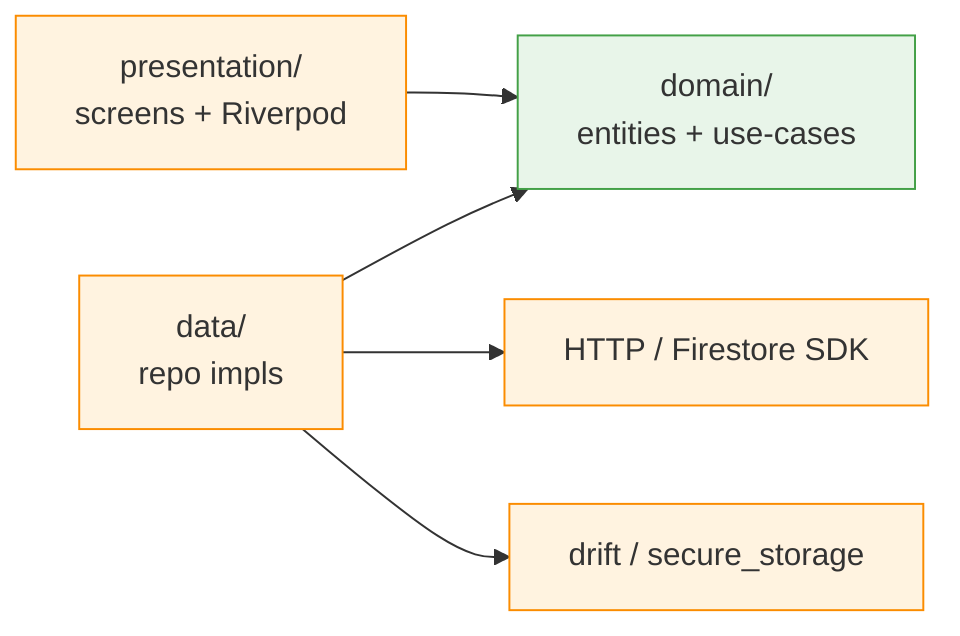

# Architecture

> **Audience:** anyone editing the codebase. Read this once before your first PR; revisit whenever a layer rule feels ambiguous. Cross-references: `PRODUCT-REQUIREMENTS.md` (what), `DATABASE_DESIGN.md` (Postgres schema), `docs/ai-workflow.md` (how AI agents collaborate), `docs/design/index.md` (per-screen specs), `firestore.rules` (Firestore security policy).

## The three pieces

```
┌─────────────────┐        HTTPS / JSON         ┌─────────────────┐
│  apps/mobile    │ ──────────────────────────▶ │    apps/api     │
│  (Flutter)      │                              │  (Elysia, Bun)  │
└─────────────────┘                              └────────┬────────┘
          ▲                                               │
          │ Dart types (generated)                        │ Prisma
          │                                               ▼
          │                                        ┌─────────────┐
          │                                        │  PostgreSQL │
          │                                        └─────────────┘
          │
  ┌───────┴────────────────────────────────┐
  │          packages/shared               │
  │   TypeBox schemas = JSON Schema        │
  │   (the single source of truth)         │
  └────────────────────────────────────────┘
```

### `apps/mobile` — Flutter

- Feature-first: everything for a feature lives under `lib/features/<feature>/{data,domain,presentation}`.
- `core/` holds cross-cutting wiring: theme, router (go_router), DI (Riverpod + Firebase init), local cache (`drift`/SQLite + `shared_preferences` + `flutter_secure_storage`), feature flags (`core/feature_flags/`), observability (`core/observability/`).
- State: Riverpod. HTTP: standard Dart client calling api with generated Dart types.
- **i18n:** Thai (`th`, default) and English (`en`). All UI strings live in `lib/l10n/app_en.arb` + `app_th.arb`; generated via `flutter gen-l10n`. Widgets access strings via `context.l10n.*` (import `lib/l10n/l10n.dart`). Font: Plus Jakarta Sans (Latin) + Sarabun fallback (Thai).
- **Platforms:** Android (full feature set) + Flutter Web (public surface only). Web omits biometric, submit, my-reports, AI search, and admin screens. Platform-specific UI gated by `kIsWeb`.

#### Clean-Arch layer rules

| Layer | Allowed dependencies | What lives here |
| --- | --- | --- |
| `presentation/` | Imports `domain/` + Flutter framework + Riverpod. **Never** imports `data/` directly. | Screens, widgets, Riverpod providers. UI talks to use-cases. |
| `domain/` | Imports nothing project-specific. Pure Dart. | Entities, value objects, use-cases, `Result<T, Failure>` types. Repository **interfaces** declared here. |
| `data/` | Implements `domain/` interfaces. Imports DTOs from `core/api_types/` (codegen) and Firestore SDK / HTTP client. | Repository implementations, mappers DTO ↔ entity. |



The arrow direction is the rule: `presentation → domain ← data`. The architect agent blocks any PR that imports across this boundary in the wrong direction (e.g. a screen importing a repo, a domain entity importing a Firestore type).

### `apps/api` — Elysia on Bun

- Feature-first: each feature lives under `src/features/<feature>/` and owns its `<feature>.route.ts` (and `<feature>.service.ts` when the route grows).
- Route files export an Elysia plugin; `src/index.ts` composes them.
- Validation via TypeBox schemas imported from `@my-product/shared` (Elysia accepts them natively).
- DB: Prisma. Schema in `prisma/schema.prisma`; client singleton at `src/core/db/client.ts`.
- Cross-cutting concerns (auth, logging) live in `src/core/middleware/` as Elysia plugins.

### `packages/shared` — the contract layer

- All request/response schemas live here as TypeBox (`@sinclair/typebox`).
- Single runtime dep: `@sinclair/typebox`.
- Exports through `src/index.ts`.
- TypeBox schemas are JSON Schema, which is what feeds the Dart codegen.

### External services

The api fans out to three external services. Mobile **does** talk directly to Firestore (read-only, narrow scope — see "Firestore mirror" below); everything else routes through the api.

| Service | What it's for | Where in the api / mobile |
| --- | --- | --- |
| Firebase Auth | Verify ID tokens server-side; sign-in flow client-side | API: `src/core/firebase/admin.ts` + `src/core/middleware/auth.middleware.ts`. Mobile: `apps/mobile/lib/core/di/firebase.dart` + `features/auth/`. |
| Firebase FCM | Server-side push (status change, announcement) | API: `src/core/firebase/admin.ts` (`messaging`). Mobile: `firebase_messaging` for receive. |
| Firebase Cloud Firestore | **Read-only mirror** of `alerts` + `my-reports/{uid}/items` for offline-first reads with real-time listeners on mobile. **Never authoritative.** | API: `src/sync/firestore_sync.ts` (server-only writes via admin SDK). Mobile: `apps/mobile/lib/features/{alerts,my_reports}/data/` (read with offline persistence). Rules: root `firestore.rules`. |
| Firebase Remote Config | Feature-flag rollout / kill-switch | Mobile: `apps/mobile/lib/core/feature_flags/feature_flags.dart`. |
| Firebase Crashlytics | Crash + non-fatal error capture | Mobile: `apps/mobile/lib/core/observability/crashlytics_init.dart` (wired in `main.dart`). |
| Firebase Analytics | Screen views + custom events | Mobile: `firebase_analytics` (no PII; hashed user IDs only). |
| Supabase | Postgres host + Storage. Mobile uploads files via the api, never directly. | Postgres → Prisma (`DATABASE_URL` / `DIRECT_URL`). Storage → `src/core/supabase/`. |
| Gemini | LLM + embeddings for AI semantic search | `src/core/gemini/client.ts` (`generateText(prompt)`, `embed(text)`). |
| Biometric (`local_auth`) | Android-only re-unlock convenience for stored Firebase session token | Mobile: `apps/mobile/lib/features/auth/data/biometric_service.dart`. Web no-op. |

All server-side singletons are lazy — the api boots even when their env vars aren't set; the first call into a missing service throws a clear error.

### Firestore mirror — narrow polyglot persistence

Postgres is **system of record** for every entity. Firestore mirrors only two read surfaces to satisfy the rubric's "polyglot persistence + offline-first" criterion without cross-store consistency headaches:

| Mirror collection | Source table | Write trigger | Read on mobile |
| --- | --- | --- | --- |
| `alerts/{announcementId}` | `announcements` | `POST/PUT/DELETE /announcements` (admin) → handler calls `mirrorAlert(...)` | `alerts/` listener with offline persistence |
| `my-reports/{uid}/items/{reportId}` | `reports` (filtered to owner) | report submit / withdraw / admin approve / reject / flag → handler calls `mirrorMyReport(...)` (status `flagged → 'pending'` for reporter view per FR-6.1) | `my-reports/{uid}/items/` listener with offline persistence |

**Rules** (`firestore.rules`):
- `alerts/**` — read public, write false (server-only via admin SDK).
- `my-reports/{uid}/items/**` — read iff `request.auth.uid == uid`, write false.

**Sync worker** (`apps/api/src/sync/firestore_sync.ts`): two functions, `mirrorAlert(alert)` and `mirrorMyReport(report)`. Called inline at the end of relevant route handlers. **Mirror failure is logged + captured by Crashlytics, never returned as a 500** — Postgres write succeeded; user-visible state is correct. A nightly reconciliation job re-mirrors any divergences.

**What stays Postgres-only:** verified feed (P-03), report detail (P-04), AI semantic search (P-09 — needs `pgvector`), moderation queue (A-01), admin review (A-02), all mutations.

### Reliability — feature flags + Crashlytics + rollback

- Every newly-shipped mobile feature is wrapped in a `FeatureFlags.isEnabled('feature_key')` boolean from Remote Config (`apps/mobile/lib/core/feature_flags/feature_flags.dart`). Default-off in prod until the team flips it.
- Crashlytics catches `FlutterError.onError` and uncaught zone errors; release builds upload symbols.
- **Rollback** is a Remote Config flag flip from the Firebase Console — no app redeploy. Migration revert + on-call escalation in `docs/rollback-plan.md`.

## Contract-first workflow

Every endpoint starts with a schema in `packages/shared`.

```
1. Edit / add schema in packages/shared/src/schemas/<area>.ts
2. Re-export from packages/shared/src/index.ts
3. Import in apps/api/src/features/<name>/<name>.route.ts and use as body / response validator
4. Run ./scripts/codegen.sh to regenerate Dart types into apps/mobile/lib/core/api_types/
5. Consume the Dart types in apps/mobile/lib/features/<feature>/data/
```

This keeps the two apps from drifting: there is no handwritten DTO on either side.

## Where to add things

| You want to... | Go to |
| --- | --- |
| Add a new API endpoint | `/add-endpoint` slash command, or follow `HOW_TO_CONTRIBUTE.md` §4 |
| Add a new mobile feature | `/add-feature` slash command, or follow `HOW_TO_CONTRIBUTE.md` §4 |
| Change a schema | Edit `packages/shared/`, then run codegen |
| Add cross-cutting middleware | `apps/api/src/core/middleware/` |
| Add theme / routing / DI | `apps/mobile/lib/core/` |
| Add a UI string (EN + TH) | Edit `apps/mobile/lib/l10n/app_en.arb` + `app_th.arb`, run `flutter gen-l10n`, access via `context.l10n.key` |
| Change DB schema | `apps/api/prisma/schema.prisma`, then `bun run prisma:generate` and create a migration |

## Testing strategy

- **Unit tests** where the logic lives. `apps/api/test/` for routes and services; `apps/mobile/test/features/` for domain + presentation.
- **Schema tests** (optional) under `packages/shared/test/` for any schema with non-trivial refinements.
- **Integration tests** for the api run against a real Postgres (test database). Do not mock Prisma for route tests — the value is in catching schema drift.
- **Widget tests** for any `presentation/` widget with conditional rendering.

Run everything: `bun run test` from the repo root.

## Conventions

- No business logic in Flutter widgets.
- Small widgets, `const` constructors wherever possible.
- Route files stay thin — push logic into `src/features/<feature>/<feature>.service.ts` (feature-local) or `src/core/lib/` (truly cross-cutting).
- Prisma client is a singleton; never instantiate `new PrismaClient()` outside `src/core/db/client.ts`.

## Not in this repo

- iOS platform folder — out of scope (no iOS build).
- Android / Web platform folders — generated locally by `flutter create .` / `flutter create --platforms web .`; not committed beyond what Flutter emits.
- Firebase config (`google-services.json`, web `firebase-config.js`) — gitignored; see `HOW_TO_CONTRIBUTE.md` §3.
- Tweaks panel from the design prototype — dev tooling only, not part of the production app.
