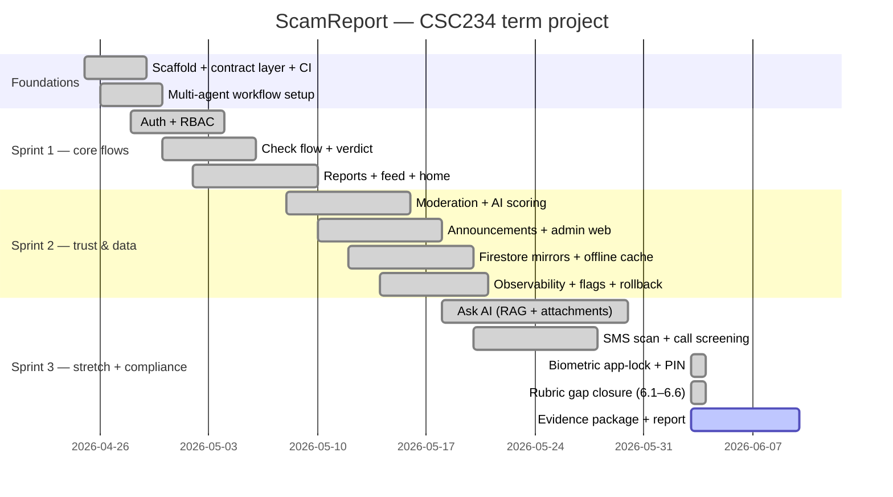

# Project Plan — WBS · Gantt · PDM

Evidence package D4. Reconstructed from the repository history (382 commits,
2026-04-25 → 2026-06-03, 103 merged PRs) and the sprint plans in
[`docs/plans/`](./plans/). Team roles per [`docs/ai-workflow.md`](./ai-workflow.md):
Orchestrator, Architect/Reviewer, QA/Release — humans gate every agent PR.

## 1. Work Breakdown Structure

```
1. Foundations
   1.1 Monorepo scaffold (bun workspaces, apps/{mobile,api,web}, packages/shared)
   1.2 Contract layer (TypeBox schemas -> Elysia validators -> Dart codegen)
   1.3 CI/CD (analyze + format + test + 80% coverage gates; gitleaks; bun audit)
   1.4 Multi-agent workflow (.claude/agents/, ai-workflow.md, evidence trail)
2. Core product flows
   2.1 Auth (Firebase email/password + /auth/sync + RBAC roles in Postgres)
   2.2 Check flow (identifier normalisation, /check, verdict screen)
   2.3 Report submission + evidence upload (Supabase storage)
   2.4 Verified feed + report detail
   2.5 Home dashboard (stats, alerts, recents)
3. Trust & moderation
   3.1 Moderation queue + admin review + audit trail
   3.2 AI scoring (Gemini) + nightly eval harness
   3.3 Announcements (admin editor -> public alerts)
   3.4 Admin web portal (React, role-gated)
4. Data & reliability
   4.1 Firestore mirrors (alerts, my-reports) + offline persistence
   4.2 Drift cache (CacheEntries, Drafts, SmsAlerts)
   4.3 Observability (Crashlytics, structured API logs, Analytics)
   4.4 Feature flags (7 Remote Config flags) + rollback plan
5. Stretch features (flag-gated)
   5.1 Ask AI (RAG over verified reports, attachments, report drafting)
   5.2 SMS smishing scan (on-device EventChannel + API verdict)
   5.3 Call screening
   5.4 Share-target + clipboard scanner
   5.5 Biometric app-lock + PIN fallback (Keystore, PBKDF2, lockout)
6. Compliance & quality (rubric closure)
   6.1 Firestore rules demo surface (profiles/{uid}: diff(), request.time) + emulator suite
   6.2 Clean-Architecture guard test + domain purity fix
   6.3 Riverpod codegen adoption (home, platform_summary, profile)
   6.4 A11y sweep (WCAG AA contrast, 48dp targets, dynamic type) + fixes
   6.5 Performance (cached images, picker compression, budgets doc)
   6.6 Integration tests (Android + Web) + CI jobs
   6.7 Evidence package (this doc, personas, screenshots, Crashlytics)
```

## 2. Gantt (reconstructed)



## 3. Precedence (PDM) — critical path

| ID | Work package | Depends on | Why |
|---|---|---|---|
| 1.2 | Contract layer | 1.1 | schemas live in packages/shared |
| 2.1 | Auth + RBAC | 1.2 | /auth/sync contract |
| 2.2–2.5 | Core flows | 2.1, 1.2 | auth gates + API contracts |
| 3.1 | Moderation | 2.3 | needs submitted reports |
| 3.2 | AI scoring | 3.1 | scores surface in the queue |
| 4.1 | Firestore mirrors | 2.3, 3.3 | mirrors Postgres write paths |
| 5.x | Stretch features | 2.x, 4.4 | all flag-gated on Remote Config |
| 6.1 | Rules demo | 4.1 | extends firestore.rules + harness |
| 6.6 | Integration tests | 2.1, 2.2, 2.5 | drive the real flows |
| 6.7 | Evidence package | everything | terminal node |

**Critical path:** 1.1 → 1.2 → 2.1 → 2.3 → 3.1 → 3.2 → 6.6 → 6.7.

## 4. Milestones

| Date | Milestone |
|---|---|
| 2026-04-29 | CI green on first vertical slice |
| 2026-05-10 | Core flows demoable (check → verdict, report → feed) |
| 2026-05-21 | Rollback drill (Procedure-1 dry-run) |
| 2026-05-30 | Ask AI shipped behind flag |
| 2026-06-03 | App-lock + full rubric gap closure (this branch) |
| 2026-06-10 | Final submission: report + evidence package |
