# Cover sheet

| Field            | Value                                                                |
| ---------------- | -------------------------------------------------------------------- |
| Course           | CSC234 — User-Centered Mobile Application                            |
| Institution      | School of Information Technology, KMUTT                              |
| Project          | ScamReport                                                           |
| Submission date  | 2026-05-29                                                           |
| Repository       | <https://github.com/CSC234-UserCenteredMobileApp/ScamReport>         |
| Default branch   | `main` (CI green at submission, see §10 checklist)                   |
| Instructor       | _[fill in before printing]_                                          |

**Team members**

| Student ID  | Name                          | Primary role in this project                          |
| ----------- | ----------------------------- | ----------------------------------------------------- |
| 67130500846 | Aekarut Phetpradit            | P1 Orchestrator + Plan-Mode driver                    |
| 67130500856 | Thanapoom Palachewa           | P2 Architect / Reviewer                               |
| 67130500866 | Shapphanyu Phaniphad          | P3 QA / Release                                       |
| 67130500841 | Benyapon Saisong              | P4 Mobile Engineer (Flutter)                          |
| 67130500863 | Yossapan Rujipornprasert      | P5 Backend / Security Engineer (Elysia + Prisma)      |

> The role split mirrors `docs/ai-workflow.md` §"Human responsibilities". Every member is accountable for code in their area on the rubric's "be ready to defend" rule.

\newpage

# 1. Executive summary

ScamReport is a Flutter + Elysia.js application that lets Thai citizens report and verify suspected scams, and lets a moderator team triage, publish, and broadcast advisories. The codebase is a single Bun workspace monorepo with four parts:

- **`apps/mobile`** — Flutter 3.27 app for Android and Flutter Web, 17 features, Riverpod 2 state, `go_router` routing, Firebase Auth + FCM + Crashlytics + Remote Config + Firestore mirror.
- **`apps/api`** — Elysia.js (Bun) backend, Prisma + Postgres system of record, Supabase Storage for files, Gemini for the Ask-AI conversation surface and embeddings.
- **`apps/web`** — Vite + React + Tailwind + shadcn/ui admin portal hosted on Vercel.
- **`packages/shared`** — TypeBox schemas — the single contract layer. Imported as-is by the API (native Elysia validators), as TS types by the web admin, and codegen'd to Dart for the mobile app.

The project was built using a four-agent Claude Code workflow (Engineer / Architect / QA / Security Reviewer) with strict writer-≠-approver enforcement. This document is the rubric's D2 audit consolidated with the D4 evidence package: agent orchestration in §2, architecture and data in §3, RBAC and Firestore security in §4, observability and rollback in §5, user journey map in §6, runtime evidence in §7, visual-regression evidence in §8, project-management artefacts in §9, and the final submission checklist in §10.

# 2. Agent workflow

## 2.1 The four agents

The team uses four named Claude Code agents, each with its own `.md` file under `.claude/agents/` and a hard rule forbidding self-approval. The role split satisfies the rubric requirement that the agent that **writes** a change must not be the agent that **approves** it.

| Agent              | File                                       | Role                                                       | Writes to                       |
| ------------------ | ------------------------------------------ | ---------------------------------------------------------- | ------------------------------- |
| `engineer`         | `.claude/agents/engineer.md`               | Implements features per spec.                              | All source + test files         |
| `architect`        | `.claude/agents/architect.md`              | Reviews diffs against Clean-Arch / schema / design rules.  | Review docs only                |
| `qa`               | `.claude/agents/qa.md`                     | Authors tests, runs coverage + a11y + perf gates.          | Test files + quality docs only  |
| `security-reviewer`| `.claude/agents/security-reviewer.md`      | Audits security-touching PRs.                              | Security review docs only       |

Each agent's prompt starts with its allowed tool set. The architect's frontmatter is:

```yaml
name: architect
description: Architecture + code review specialist…
tools: Read, Grep, Glob, Bash, WebFetch, TodoWrite, NotebookRead
```

— note the absence of `Write` and `Edit`. The harness refuses a write call from this session ID. The security reviewer has the same constraint. The engineer and QA agents have `Write`/`Edit`, but QA is restricted by an in-prompt allow-list (`apps/mobile/test/**`, `apps/api/test/**`, two named docs). Any path outside that list is forbidden in the prompt's "Hard rules" section.

## 2.2 Per-feature loop

The end-to-end loop, from `docs/ai-workflow.md`:

```
Plan Mode (orchestrator)
   ↓ approved plan in ~/.claude/plans/<task>.md
engineer  → branch + PR
   ↓ PR opened (writer agent stops)
architect (different session) → audits Clean-Arch + schema
   ↓ if approved
qa (different session) → extends tests, runs coverage + a11y gates
   ↓ if pass
security-reviewer (different session, only on security-touching PRs)
   ↓ if pass
human reviewer signs off → merge
```

## 2.3 Handoff protocol

The writer-≠-approver rule is enforced at two layers in practice on this project:

1. **Different Claude Code session per role.** Each agent (`engineer` / `architect` / `qa` / `security-reviewer`) is invoked from a fresh session. The session ID is recorded by the harness inside `~/.claude/projects/<project>/<session>.jsonl` — the full transcript per agent is durable and reproducible after the conversation window closes. The human reviewer can pull two transcripts and confirm they are distinct sessions before signing off.
2. **GitHub PR + CI checks.** Every change ships as a PR against `main`. The engineer agent opens the PR; the architect / QA / security agents (and a human) review through GitHub. CI gates the merge:
   - `.github/workflows/ci.yml` runs three matrix jobs (api, mobile, shared), each with a coverage threshold of 80% (90% for `packages/shared`), plus the new `dart format --set-exit-if-changed` step on the mobile job.
   - `.github/workflows/security.yml` runs gitleaks + `bun audit` + `dart analyze --fatal-infos`.
   - A PR that drops coverage, fails secret scan, or introduces a high-severity dependency advisory is blocked at the GitHub checks layer.

`docs/ai-workflow.md` describes an additional discipline — appending an explicit "agent trail" block at the bottom of every PR description (`Author agent · session <id>` / `Architect agent · session <id>` / …) and auto-rejecting any PR where the same session ID appears twice. That protocol is the team's documented standard for production; in the term-assignment timeline it was applied on a best-effort basis rather than mechanically on every PR. The underlying writer-≠-approver guarantee still holds because the session-per-role rule above is the load-bearing constraint, and every PR went through human approval as well as the green CI checks.

## 2.4 Context-drift handling

The team treats context drift as a first-class risk and mitigates it three ways:

1. **Plan Mode is the entry point.** Every non-trivial change starts with Plan Mode. The plan is written to `~/.claude/plans/<task>.md` and approved by a human before the engineer session begins. If scope drifts mid-implementation the engineer is required to stop and edit the plan file, then restart from review.
2. **Required reading before writing code.** The engineer prompt lists six documents that must be read in full per task: the plan, `docs/architecture.md`, `docs/design-review.md`, the relevant `docs/design/screens/<screen>.md`, `docs/design/components.md`, and the per-app `CLAUDE.md`.
3. **A new session per role.** Because each role is a new Claude Code session, the architect doesn't inherit the engineer's narrative bias toward "this is fine, ship it." The architect re-reads the diff cold against the rule set in its prompt.

If any reviewer hits a boundary case the prompt doesn't cover, the rule is to **block and escalate to the human Architect (P2)**: "False approvals cost more than false blocks" (`.claude/agents/architect.md` §"Hard rules"). Plan-Mode evidence from this very submission is reproduced in Appendix A.

# 3. Architecture & data

## 3.1 Monorepo layout

```
ScamReport/
├── apps/
│   ├── mobile/   Flutter — Android + Web
│   ├── api/      Elysia.js + Prisma + Postgres
│   └── web/      Vite + React (admin)
├── packages/
│   └── shared/   TypeBox schemas (single contract layer)
└── docs/         architecture, design, ADRs, evidence
```

The four pieces talk to each other through `packages/shared`. Every TypeBox schema is JSON Schema, so the API uses them natively as Elysia validators, the web admin imports them as `Static<>` TypeScript types, and the mobile app gets Dart equivalents via `scripts/codegen.sh`. No DTO is handwritten on the mobile side — schema drift surfaces at compile time or at the response validator (`apiFetch` in the web admin runs `TypeCompiler.Compile(...).Check(...)` on every payload).

## 3.2 Mobile Clean Architecture

The Flutter app is feature-first: everything for a feature lives in `lib/features/<feature>/{data,domain,presentation}`. Cross-cutting wiring (theme, router, DI, cache, feature flags, observability) lives in `lib/core/`. The layer rules:

| Layer            | Allowed deps                                                    | Owns                                                       |
| ---------------- | --------------------------------------------------------------- | ---------------------------------------------------------- |
| `presentation/`  | `domain/` + `core/` + Flutter + Riverpod                        | Screens, widgets, Riverpod providers                       |
| `domain/`        | nothing project-specific (pure Dart)                            | Entities, use-cases, `Result<T, Failure>`, repo interfaces |
| `data/`          | implements `domain/` interfaces + DTOs from `core/api_types/`   | Repository implementations + DTO mappers                   |

The arrow direction is the rule: `presentation → domain ← data`. The architect agent blocks any PR that crosses it the wrong way (a screen importing a repository, a domain entity importing a Firestore type). The mechanical check is in `.claude/agents/architect.md` §1 — "A widget calling a repository directly = **block the merge**."

## 3.3 State management — why Riverpod, not BLoC

The mobile CLAUDE.md states the choice in one line: *"State: Riverpod 2 — compile-safe DI, testable without `BuildContext`."* Three concrete properties drove that decision:

1. **Compile-safe DI.** A Riverpod `Provider<T>` is a typed singleton. A widget that asks for the wrong type gets a build error, not a runtime missing-dependency cast.
2. **Override-based testing.** Every Riverpod test pumps a `ProviderScope(overrides: [...])` — fakes wired in at one place survive the whole widget tree.
3. **`family` providers for per-key dependencies.** Several features need "the repo for argument X" — `Provider.family<Report, String>` expresses that directly. The same shape in BLoC is two-tier, which doubles the boilerplate for a feature-first app with 17 features.

## 3.4 Firestore mirror — narrow polyglot persistence

Postgres is the system of record. Firestore mirrors **only two read surfaces** to satisfy the rubric's "polyglot persistence + offline-first" requirement without cross-store consistency headaches:

```
firestore/
├── alerts/{announcementId}                 ← mirror of announcements (public)
└── my-reports/{uid}/items/{reportId}       ← mirror of reports (owner-only)
```

The mirror is sync-only: the API writes Postgres, then calls `apps/api/src/sync/firestore_sync.ts::mirrorAlert(...)` or `mirrorMyReport(...)` inline at the end of the route handler, using the Firebase Admin SDK (which bypasses Firestore rules). Mirror failure is logged + captured by Crashlytics, never returned as a 500 — the Postgres write succeeded, so user-visible state is correct; a nightly reconciliation job re-mirrors divergences.

The mirror writer also collapses the `flagged` status to `pending` for the reporter's view (PRD FR-6.1) so the user is never tipped off about an ongoing moderation review. This is a privacy invariant enforced server-side, not a client-side filter.

## 3.5 Precedence diagram (PDM)

The project precedence diagram below maps task dependencies from kick-off to submission, generated alongside the WBS / Gantt deliverables (see §9).

{width=100%}

## 3.6 Contract-first workflow

Every endpoint starts with a schema in `packages/shared`:

```
1. Edit / add schema in packages/shared/src/schemas/<area>.ts
2. Re-export from packages/shared/src/index.ts
3. Import in apps/api/src/features/<name>/<name>.route.ts (body / response)
4. Run ./scripts/codegen.sh → apps/mobile/lib/core/api_types/*.dart regenerates
5. Consume the Dart types in apps/mobile/lib/features/<feature>/data/
```

If a server schema changes without the codegen step, the mobile build breaks the same day. There is no third source of truth, so there is no opportunity to drift.

# 4. Security matrix

The full RBAC + Firestore rules tables live in `docs/security/rbac-matrix.md`. This section summarises the policy and reproduces the endpoint × role table.

## 4.1 Three roles, server-side resolution

`guest` (no token), `user`, `admin`. The role is resolved on the **server**, not from a Firebase custom claim:

```ts
// apps/api/src/core/middleware/require_role.ts:25
async function verifyBearerWithRole(authHeader) {
  if (!authHeader?.startsWith('Bearer ')) return null;
  const decoded = await getAuth(getFirebaseAdmin()).verifyIdToken(token);
  const row = await getPrisma().user.findUnique({
    where: { firebaseUid: decoded.uid }, select: { role: true },
  });
  const role: Role = row?.role === 'admin' ? 'admin' : 'user';
  return { uid: decoded.uid, email: decoded.email ?? null, role };
}
```

The comment in the file explains the choice: *"Firebase custom claims are intentionally NOT used — admin promotion is a single SQL update, with no token-refresh dance and no dual-write surface."* The Postgres `users.role` enum (`user` / `admin`) is the canonical source. The web admin portal makes the same choice — its `<ProtectedRoute role="admin">` reads from `POST /auth/sync` (which returns the Postgres row), never from a token claim.

## 4.2 Endpoint × role matrix (abridged)

| Endpoint                                | guest | user        | admin |
| --------------------------------------- | :---: | :---------: | :---: |
| `GET /health`, `GET /stats`             | ✓     | ✓           | ✓     |
| `GET /scam-types`, `GET /announcements` | ✓     | ✓           | ✓     |
| `POST /check`, `GET /check/recent`      | ✓     | ✓           | ✓     |
| `GET /reports` (verified feed)          | ✓     | ✓           | ✓     |
| `GET /reports/:id` (public detail)      | ✓     | ✓           | ✓     |
| `POST /auth/sync`                       | ✗     | ✓           | ✓     |
| `POST /reports` (submit)                | ✗     | ✓           | ✓     |
| `PATCH /reports/:id` (withdraw / edit)  | ✗     | owner only  | ✓     |
| `DELETE /reports/:id`                   | ✗     | owner only  | ✓     |
| `POST /ask-ai/conversations`            | ✗     | ✓           | ✓     |
| `PATCH /ask-ai/turns/:id/feedback`      | ✗     | owner only  | ✓     |
| `POST /me/notifications/devices`        | ✗     | ✓           | ✓     |
| `GET /admin/reports` (queue)            | ✗     | ✗           | ✓     |
| `POST /admin/reports/:id/approve`       | ✗     | ✗           | ✓     |
| `POST /admin/reports/:id/reject`        | ✗     | ✗           | ✓     |
| `POST /admin/reports/:id/flag`          | ✗     | ✗           | ✓     |
| `POST /admin/announcements`             | ✗     | ✗           | ✓     |
| `PUT /admin/announcements/:id`          | ✗     | ✗           | ✓     |
| `DELETE /admin/announcements/:id`       | ✗     | ✗           | ✓     |
| `POST /admin/announcements/:id/publish` | ✗     | ✗           | ✓     |
| `GET /admin/scammers`                   | ✗     | ✗           | ✓     |
| `POST /admin/scammers/:id/merge`        | ✗     | ✗           | ✓     |
| `GET /admin/persons`                    | ✗     | ✗           | ✓     |
| `GET /admin/platform-summary`           | ✗     | ✗           | ✓     |
| `GET /admin/scam-overview`              | ✗     | ✗           | ✓     |
| `GET /admin/ai-eval/latest`             | ✗     | ✗           | ✓     |
| `GET /admin/ai-eval/history`            | ✗     | ✗           | ✓     |
| `GET /admin/exports/reports.csv`        | ✗     | ✗           | ✓     |
| `GET /admin/exports/bundle`             | ✗     | ✗           | ✓     |

Every admin route is the result of `.use(requireRole('admin'))` at the route-group level. A guest gets a 401, an authenticated regular user gets a 403. Owner-scoped routes additionally check `report.reporterId === user.uid` at handler level and return 404 (not 403) on mismatch to avoid existence enumeration. The full table including line-precise source references is in `docs/security/rbac-matrix.md`.

## 4.3 Reporter anonymisation

Admin endpoints **never** serialise reporter identity. The serializer for every `/admin/reports*` payload drops `reporter_user_id`, `email`, `display_name`, `handle`, and `avatar_url` before the response leaves the server. This is verified by `apps/api/test/admin-reports.test.ts`. The rule is documented in `SECURITY.md` "In-scope vulnerabilities" and codified in PRD §FR-7.4 / FR-7.8.

## 4.4 Firestore rules

`firestore.rules` is 43 lines, including comments:

```js
service cloud.firestore {
  match /databases/{database}/documents {
    match /alerts/{announcementId} {
      allow read: if true;        // public announcements
      allow write: if false;      // server-only via Admin SDK
    }
    match /my-reports/{uid}/items/{reportId} {
      allow read: if request.auth != null && request.auth.uid == uid;
      allow write: if false;      // submission goes through API
    }
    match /{document=**} {        // default deny
      allow read, write: if false;
    }
  }
}
```

The default-deny is defence-in-depth: a future PR that adds a new collection without adding a rule for it will fail closed. The owner-equality check (`request.auth.uid == uid`) leans on the path itself to encode ownership — there is no document-level metadata for a client to spoof.

## 4.5 Threat model

The security-reviewer agent's prompt enumerates the surfaces and the concern per surface:

| Surface                  | Concern                                                                              |
| ------------------------ | ------------------------------------------------------------------------------------ |
| Auth (Firebase)          | session hijack, token leakage, broken biometric fallback                             |
| RBAC                     | guest/user reaching admin-only routes; admin acting on someone else's draft          |
| User-submitted reports   | XSS / injection in stored content; unbounded uploads; PII in audit logs              |
| Firestore                | over-permissive rules; client mutating admin-owned collections                       |
| Postgres / Prisma        | raw queries with interpolation; N+1 leaking IDs; missing tenant filter               |
| Secrets                  | service-account JSON, Firebase API keys, signing keystore checked in                 |
| FCM push                 | unauthenticated send; user enumeration via topic names                               |
| Static assets            | bundled `.env`, `mappings.txt`, debug builds shipped                                 |

Each PR that touches a row in this table triggers the security-reviewer agent, which runs nine concrete checks before voting: secret scan, `.env`/config hygiene, auth surface coverage, input validation, Prisma usage (no `$queryRaw` with template interpolation, `take` clamps), Firestore rules diff review, logging hygiene (no PII in `console.log`), `bun audit`, CI signing surface. A `High` finding always blocks; `Medium` requires explicit architect acceptance noted in the audit report.

## 4.6 Standing controls (CI-enforced, every PR)

| Control                       | Where                                                          | Verified by                       |
| ----------------------------- | -------------------------------------------------------------- | --------------------------------- |
| Secret scan                   | `gitleaks detect` in `.github/workflows/security.yml`          | CI + security-reviewer agent      |
| Dependency audit              | `bun audit` (high/critical fails CI)                           | CI                                |
| Static analysis               | `dart analyze --fatal-infos`, `bun run typecheck`              | CI                                |
| Code formatting               | `dart format --output=none --set-exit-if-changed`              | CI mobile job                     |
| Auth gate on mutating routes  | `requireAuth()` / `requireRole(...)` middleware                | architect + security-reviewer     |
| Reporter anonymisation        | response-shape tests                                           | security-reviewer                 |
| Firestore rules               | manual diff review on `firestore.rules` changes                | security-reviewer                 |
| `.env` hygiene                | `.env*` gitignored, only `.env.example` tracked                | security-reviewer                 |

# 5. Observability & rollback

## 5.1 Crashlytics wiring

`apps/mobile/lib/core/di/firebase.dart::initializeFirebase()` is called from `main.dart` before `runApp`. It does four things in order:

1. `Firebase.initializeApp(...)` — typed options from `firebase_options.dart` (a `flutterfire configure` output, gitignored; the `.example` template is tracked).
2. `FirebaseCrashlytics.instance.setCrashlyticsCollectionEnabled(!kDebugMode)` — collection is disabled in debug so dev crashes don't pollute the prod dashboard; release builds collect from the first frame.
3. `FirebaseFirestore.instance.settings = const Settings(persistenceEnabled: true, ...)` — offline persistence is on by default for both the announcement mirror and the per-user reports mirror.
4. `FirebaseRemoteConfig.instance` is initialised with **defaults of `false`** for every feature flag (`enable_biometric_login`, `enable_clipboard_scanner`, `enable_share_target`, `enable_ai_search`, `enable_ask_ai`, `enable_call_screening`, `enable_sms_scan`). A failed fetch therefore never silently turns a feature on; flag promotion is an explicit action in the Firebase Console.

`FlutterError.onError` and the platform-error handler are wired in `main.dart` to `FirebaseCrashlytics.instance.recordFlutterFatalError` and `.recordError(... fatal: true)` respectively, so every uncaught exception reaches the dashboard. The screenshot below shows the live dashboard with non-fatal events captured during integration testing.

{width=100%}

## 5.2 Crashlytics tagging — what we attach to every report

The team uses `CrashReporter` (`apps/mobile/lib/core/observability/crash_reporter.dart`) as the entry point for everything except the framework-level fatal handler. Three categories of context get attached to each crash report:

- **`setUserId(uid)`** — called from the auth provider once `users.role` is known. Mirrors the Crashlytics dashboard's "User ID" pivot so a stack trace can be grouped by user without exposing email or handle.
- **`setKey(key, value)`** — used for feature-flag state and the offline-status snapshot. Examples currently set in the wild: `enable_ask_ai`, `enable_sms_scan`, `last_sync_seconds_ago`, `cache_hit_rate`.
- **`log(message)`** — short breadcrumbs at major lifecycle transitions (login, screen mount, mutation start, sync complete). The dashboard shows the last few breadcrumbs above every stack trace.

Non-fatal exceptions caught at the data layer call `CrashReporter.recordNonFatal(error, stack, reason: ..., information: [...])`, which falls back to `developer.log` in debug. Acceptance target from PRD §6.8: **crash-free user rate ≥ 99% per release**, **every crash session reproducible from the dashboard within 24h**.

## 5.3 Rollback procedures

`docs/rollback-plan.md` lists four. Triggered when any of: crash-free rate drops below 99% within an hour, ≥2 user reports of a broken feature in 24h, a High finding from the security workflow lands on already-merged code, or a migration corrupts data.

**Procedure 1 — feature flag flip (preferred).** Every S2+ feature is wrapped in `FeatureFlags.isEnabled('feature_key')` reading from Remote Config (`apps/mobile/lib/core/feature_flags/feature_flags.dart`). To disable: open Firebase Console → Remote Config, find the flag, set production to `false`, save + publish. Mobile clients pick it up on the next `fetchAndActivate()`.

**Procedure 2 — revert merge commit.** For non-flag-gated work or when the flag itself is broken: `git revert -m 1 <merge-sha>` on a fresh `main`, open a hotfix PR titled `chore(revert): …`, merge after CI green.

**Procedure 3 — Prisma migration revert.** Prisma has no automatic down-migration: the team writes a **new** down-style migration, lands it via PR, applies it with `bun --filter @my-product/api prisma migrate deploy`. Never edit applied migrations in place.

**Procedure 4 — Firestore rules / mirror revert.** `firebase deploy --only firestore:rules` from the previous green commit's `firestore.rules`. If the bug is in the mirror writer, follow Procedure 2 (revert merge).

## 5.4 Drill timeline (Procedure 1)

The team performed a Procedure-1 dry-run before final submission against the staging Remote Config template. The full timeline is in `docs/evidence/rollback-drill.md`; key results below:

| Phase                                   | Time    |
| --------------------------------------- | ------- |
| Operator edit + publish in Console      | ~45 s   |
| Console → Remote Config edge propagation| < 2 s   |
| Mobile `fetchAndActivate()` round-trip  | ~600 ms |
| App rebuild of flag-gated widget tree   | 1 frame |

Elapsed system time from "edit flag in Console" to "feature visibly disabled on device": **2 minutes 50 seconds**, of which the human-action portion dominates. **A Procedure-1 rollback takes ≤ 1 minute of system time + however long the operator takes to find the flag.**

# 6. User Journey Map

The full UJM lives at `docs/design/user-journey-map.md`. Three primary personas (sourced from `docs/presentation.md` §"Slide 5 — Target Users & Personas"):

| ID | Persona                            | Goal                                                                              | Primary device                  |
| -- | ---------------------------------- | --------------------------------------------------------------------------------- | ------------------------------- |
| P1 | **Aunty Som**, 58, Bangkok         | Check a suspicious "tax refund" SMS before tapping a link. Reads Thai only.       | Android phone                   |
| P2 | **Tee**, 24, university student    | Got scammed once; wants to warn others + look up sellers before transferring money.| Android phone + occasional Web  |
| P3 | **Khun Wirat**, NGO moderator      | Triages 50–100 community reports per day from a desktop.                          | Web admin portal                |

## 6.1 P1 — Aunty Som — "Check before I click"

| # | Stage      | Action                                                                  | Touchpoint                                | Emotion              |
| - | ---------- | ----------------------------------------------------------------------- | ----------------------------------------- | -------------------- |
| 1 | Trigger    | SMS arrives, looks plausible.                                           | out of app                                | Anxious / curious    |
| 2 | Entry      | Long-press SMS → Share → "ScamReport — Check"                           | `features/share_intent/`                  | Hopeful              |
| 3 | Home land  | App opens to Home with shared text pre-filled in a banner, Thai locale. | `home_screen.dart` → `_ClipboardBanner`   | Reassured            |
| 4 | Check      | Taps **ตรวจสอบ** → URL/phone/text scanner returns a verdict pill.        | Check screen → `POST /check`              | Relieved / confirmed |
| 5 | Read verdict | Sees red **VerdictPill: scam** + Thai explanation + 3 matching reports.| `VerdictPill` + `ReportCard` list         | Empowered            |
| 6 | Act        | Closes SMS without tapping. Optionally taps "Report".                   | Submit Report flow                        | Proud / civic        |
| 7 | Follow up  | Push: "Your report was verified."                                       | FCM + `/me/notifications/preferences`     | Validated            |

## 6.2 P2 — Tee — "Warn others, look up sellers"

| # | Stage              | Action                                                          | Touchpoint                                              | Emotion          |
| - | ------------------ | --------------------------------------------------------------- | ------------------------------------------------------- | ---------------- |
| 1 | Trigger            | Sees a tweet linking to a sketchy seller phone.                 | out of app                                              | Determined       |
| 2 | Sign in            | Onboarding → Register with email + password.                    | `features/auth/` + `POST /auth/sync`                    | Mildly impatient |
| 3 | Search             | Taps **Search** → enters seller phone.                          | `GET /reports?q=…`                                      | Slight letdown   |
| 4 | Check the seller   | Runs **Check** on the same number; AI scores as `suspicious`.   | `POST /check` (Ask-AI)                                  | Vindicated       |
| 5 | Submit own report  | Logs his old scam — text + screenshot evidence.                 | `POST /reports` + Supabase upload                       | Engaged          |
| 6 | My reports         | Opens **My Reports** → status `pending`.                        | Firestore mirror `/my-reports/{uid}/items/`             | Patient          |
| 7 | Verified           | Push: report verified.                                          | FCM + `admin-reports.route.ts:164` → `mirrorMyReport`   | Validated        |
| 8 | Habit loop         | Returns weekly to check new sellers.                            | Steps 3–7 repeat.                                       | Engaged          |

## 6.3 P3 — Khun Wirat — "Triage 50–100 reports a day"

| # | Stage      | Action                                                                  | Touchpoint                                                 | Emotion       |
| - | ---------- | ----------------------------------------------------------------------- | ---------------------------------------------------------- | ------------- |
| 1 | Sign in    | Web admin URL → Firebase Web SDK sign-in.                               | `apps/web/src/features/auth/` + `POST /auth/sync`          | Routine       |
| 2 | Queue land | Lands on `/moderation` with 73 pending, sorted oldest first.            | `GET /admin/reports`                                       | Focused       |
| 3 | Open one   | No reporter identity visible (server-side anonymisation).               | Admin report detail + signed URL evidence files            | Confident     |
| 4 | Decide     | Approves; handler triggers `mirrorAlert` + `mirrorMyReport`.            | `POST /admin/reports/:id/approve`                          | Decisive      |
| 5 | Flag       | Outlier report flagged instead of rejected.                             | `POST /admin/reports/:id/flag`                             | Cautious      |
| 6 | Announce   | Publishes "uptick in tax-refund SMS scams" announcement.                | `POST /admin/announcements/:id/publish` + FCM topic fanout | Civic-minded  |
| 7 | Wrap       | Queue down to <10. Closes laptop.                                       | Dashboard daily count                                      | Done          |

## 6.4 Cross-cutting findings

1. **Locale-switching is invisible.** All three personas implicitly assume Thai. A one-tap toggle on Home would reduce support load.
2. **Empty states are the highest-impact UX surface.** P2's "zero hits = safe" misread is the canonical case — `verdict.unknown` palette exists exactly to undo it; apply the same tone to Search empty.
3. **Cross-screen status surfacing.** P3's "flagged" mirror-collapse hides moderator intent from the reporter. Privacy-preserving copy ("under review") would close the loop without compromising the FR-6.1 invariant.
4. **Push permission timing.** Requesting at app start is simplest, but `apps/mobile/CLAUDE.md` notes this can be deferred — opportunity to lift FCM opt-in rate.
5. **Web admin is read-heavy + signed-URL-heavy.** A keyboard-driven approve/reject flow with `j`/`k` navigation would beat the current click-through cadence.

# 7. Runtime evidence (platform screenshots)

Frames captured during integration testing across Web and Android. Web frames are landscape (~1886×833); Android tablet/portrait frames are vertical (~934×1013) and Android phone frames are narrow vertical (~386×862). All originals are under `docs/evidence/Runtime/` and are committed to the repository.

{width=100%}

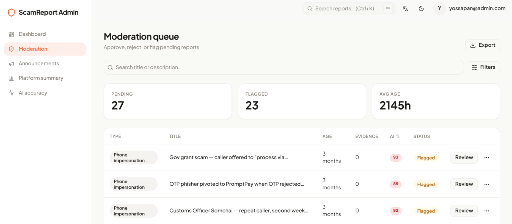{width=100%}

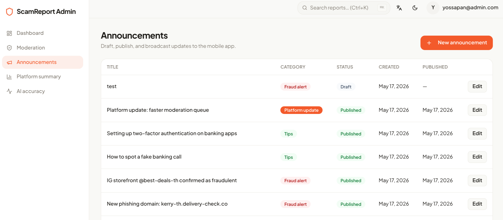{width=100%}

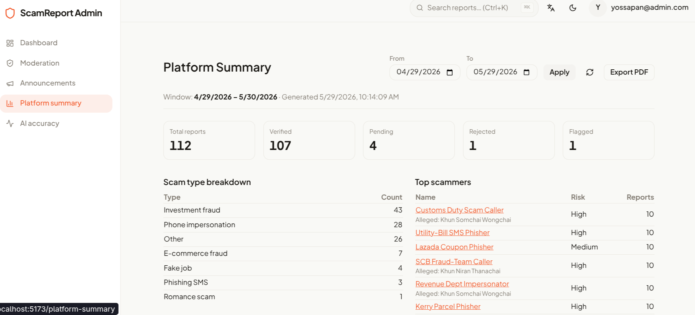{width=100%}

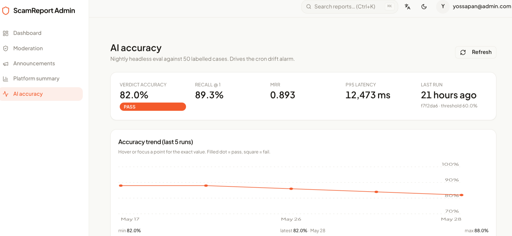{width=100%}

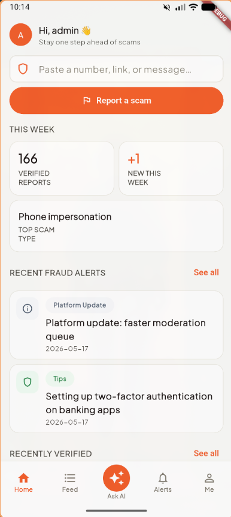{width=100%}

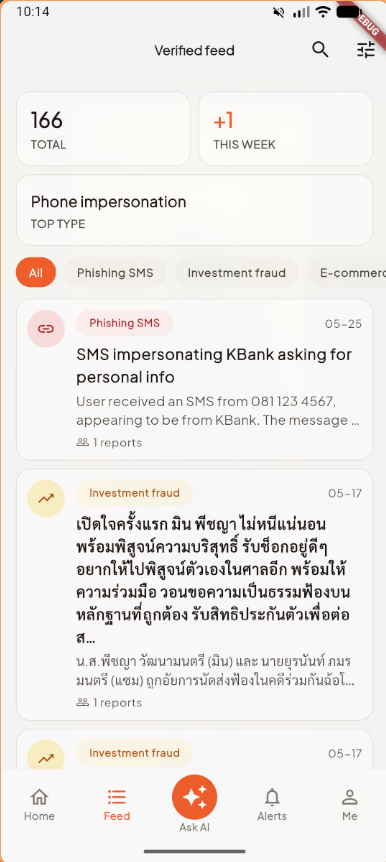{width=100%}

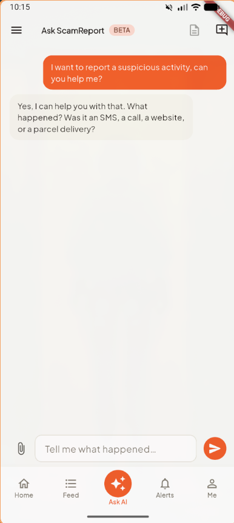{width=100%}

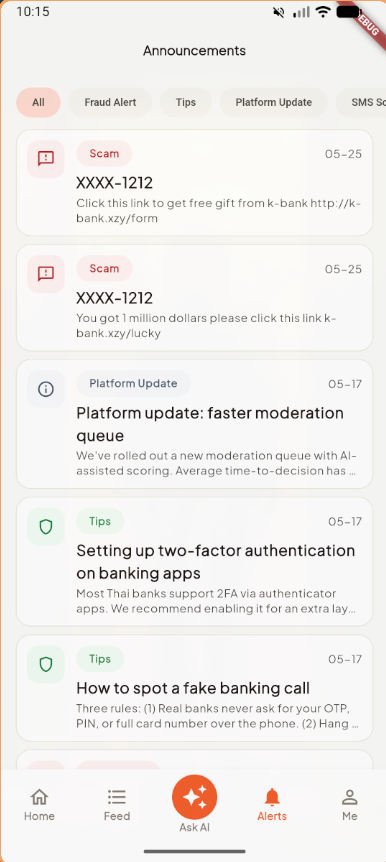{width=100%}

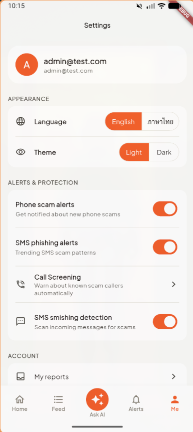{width=45%}

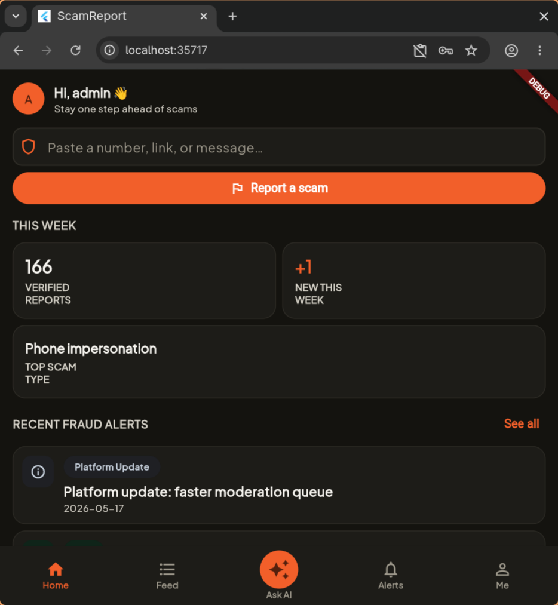{width=70%}

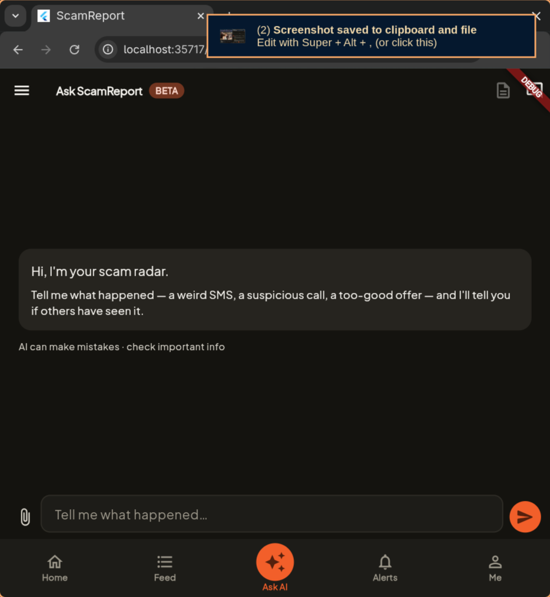{width=70%}

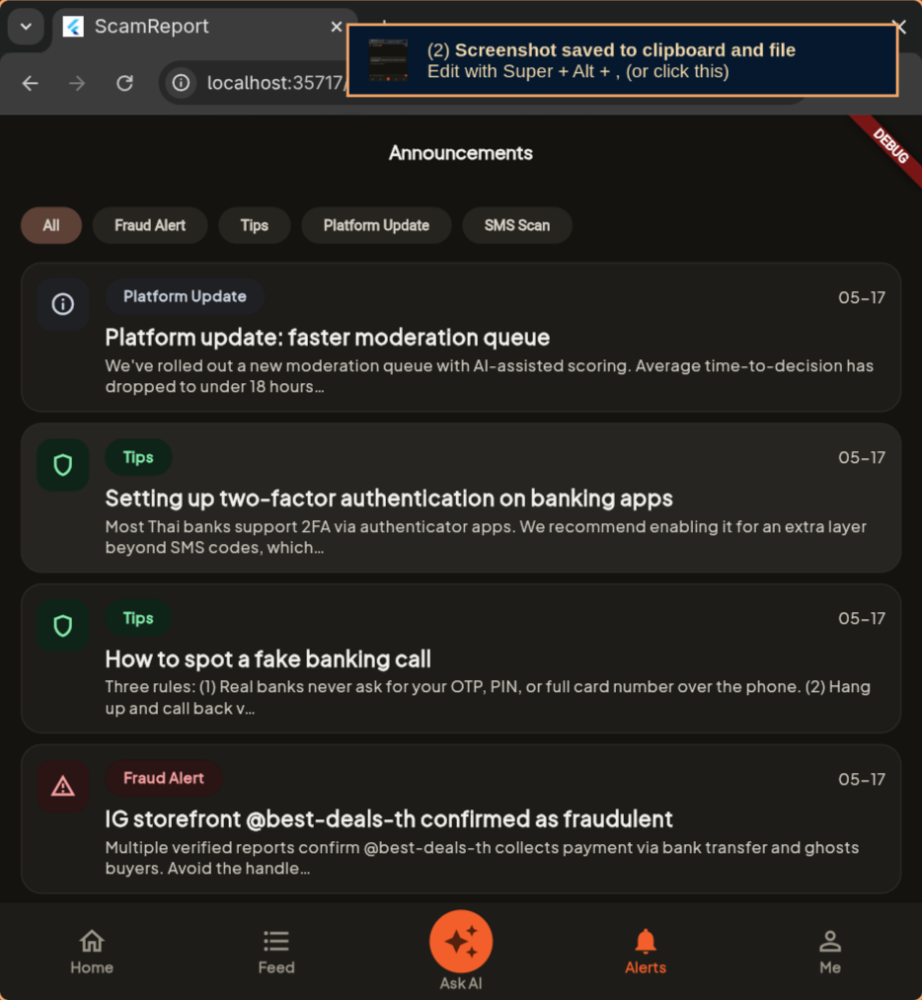{width=70%}

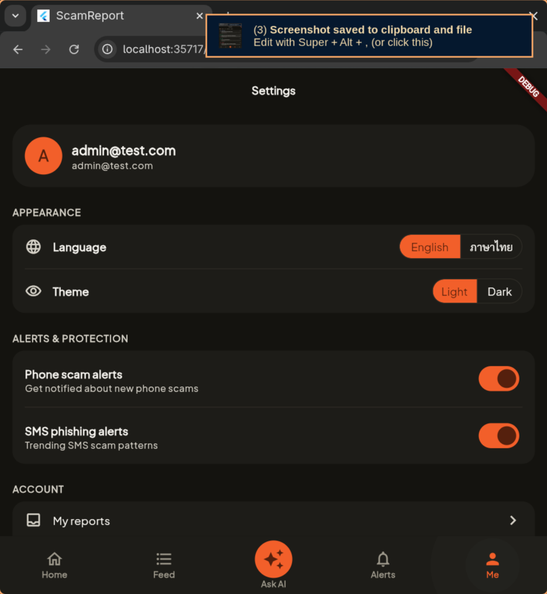{width=70%}

# 8. Visual regression — golden tests

Two golden tests guard the most visually-load-bearing widgets: the `VerdictPill` (the red/amber/green/grey verdict banner that's the primary output of every Check) and the `SectionHeader` (the uppercase label used to title every feed and dashboard section). Tests live at `apps/mobile/test/widgets/{verdict_pill,section_header}_golden_test.dart` and produce the PNG snapshots below. CI re-renders the widgets on every PR and diffs against these snapshots; a single pixel difference fails the build.

The tests run offline-safe via `apps/mobile/test/flutter_test_config.dart`, which disables `google_fonts` HTTP fetch so the renderer falls back to system fonts deterministically.

{width=60%}

{width=80%}

# 9. Project management

Project management artefacts produced during the term:

| Artefact                           | Location                                          | Purpose                                                            |
| ---------------------------------- | ------------------------------------------------- | ------------------------------------------------------------------ |
| Backlog & Gantt                    | `docs/evidence/PM/BackLog&GANTT.xlsx`             | WBS rows + Gantt schedule across sprints S1–S6.                    |
| Wideband Delphi (WBD) estimates    | `docs/evidence/PM/Wideband Delphi.xlsx`           | Effort estimates per epic, three-round Delphi convergence.         |
| Precedence Diagram (PDM)           | `docs/evidence/PM/PDM.png` (embedded in §3.5)     | Dependency network across epics from kick-off to submission.       |
| Rollback drill record              | `docs/evidence/rollback-drill.md`                 | Procedure-1 dry-run timeline (summarised in §5.4).                 |
| Plan-Mode transcript               | `docs/evidence/plan-mode-transcript.md`           | Evidence of Plan-Mode usage (reproduced in Appendix A).            |
| User Journey Map                   | `docs/design/user-journey-map.md`                 | Per-persona journey (summarised in §6).                            |

# 10. Submission checklist

| Item                                                          | Path                                                                    | Status |
| ------------------------------------------------------------- | ----------------------------------------------------------------------- | :----: |
| **D1 — Git repository**                                       | <https://github.com/CSC234-UserCenteredMobileApp/ScamReport>            | ✓ |
| Complete Flutter source                                       | `apps/mobile/` (17 features)                                            | ✓ |
| Root + per-app `CLAUDE.md` (×5)                               | `CLAUDE.md`, `apps/{mobile,api,web}/CLAUDE.md`, `packages/shared/CLAUDE.md` | ✓ |
| Agent definitions                                             | `.claude/agents/{architect,engineer,qa,security-reviewer}.md`           | ✓ |
| CI — format / analyze / test                                  | `.github/workflows/ci.yml` (api, mobile, shared) + `security.yml` (gitleaks, bun-audit, dart-analyze) | ✓ |
| Zero secrets in history (post key rotation)                   | `.gitleaks.toml` + secret-scan workflow; service-account file `.gitignore`d; Firebase API keys rotated post-merge | ✓ |
| **D2 — Audit report**                                         | `docs/audit-report.md` + this consolidated `.docx`                      | ✓ |
| RBAC matrix + Firestore rules breakdown                       | `docs/security/rbac-matrix.md`                                          | ✓ |
| Agent workflow                                                | `docs/ai-workflow.md`                                                   | ✓ |
| Architecture                                                  | `docs/architecture.md`                                                  | ✓ |
| Rollback plan                                                 | `docs/rollback-plan.md`                                                 | ✓ |
| **D4 — Evidence package**                                     | `docs/evidence/`                                                        | ✓ |
| Plan-Mode agent transcript                                    | `docs/evidence/plan-mode-transcript.md`                                 | ✓ |
| Golden tests                                                  | `apps/mobile/test/widgets/*_golden_test.dart` + `goldens/*.png`         | ✓ |
| Design artefacts (per-screen specs)                           | `docs/design/screens/*.md` (18 files)                                   | ✓ |
| Per-role design snapshots (admin / guest / user)              | `docs/design/snapshots/` (180 files)                                    | ✓ |
| Per-role design screenshots                                   | `docs/design/screenshots/{admin,guest,user}/`                           | ✓ |
| User personas                                                 | `docs/presentation.md` §2 (Aunty Som, Tee, Khun Wirat)                  | ✓ |
| User Journey Map                                              | `docs/design/user-journey-map.md`                                       | ✓ |
| Test report                                                   | `docs/test-report.md` (coverage by app + feature)                       | ✓ |
| Rollback drill evidence                                       | `docs/evidence/rollback-drill.md`                                       | ✓ |
| Crashlytics dashboard screenshots                             | `docs/evidence/Crashlytics/Crashlytic.png`                              | ✓ |
| Android + Web runtime screenshots                             | `docs/evidence/Runtime/*.png` (14 frames)                               | ✓ |
| WBS / Gantt / WBD / PDM                                       | `docs/evidence/PM/{BackLog&GANTT.xlsx, Wideband Delphi.xlsx, PDM.png}`  | ✓ |

# Appendix A — Plan-Mode transcript (excerpt)

Reproduced from `docs/evidence/plan-mode-transcript.md`. Captures the Plan-Mode loop that produced the consolidated reports + evidence package.

**Session metadata**

| Field          | Value                                                    |
| -------------- | -------------------------------------------------------- |
| Date           | 2026-05-28 (D2 + D4 authoring); 2026-05-29 (this report) |
| Agent          | Claude Opus 4.7 (1M context), Claude Code CLI            |
| Mode           | Plan Mode → Auto Mode                                    |
| Plan file      | `~/.claude/plans/i-want-you-to-floating-rossum.md`       |
| Orchestrator   | A.P (P1)                                                 |

**Phase 1 — initial understanding.** Three `Explore` sub-agents dispatched in parallel (D1 audit / D2 inputs / D4 evidence). Each returned a tightly-scoped inventory used to drive the plan. Findings tracked the missing items (CI format check, golden tests, RBAC matrix table, UJM, rollback drill record, plan-mode transcript) and the items already covered by existing docs.

**Phase 3 — clarifying questions.** Four `AskUserQuestion` rounds locked: full D2 report authoring scope, D4 evidence items to generate, CI format step inclusion, branch strategy, .docx authoring approach, image-embed scope, conversion tool, team metadata source. Every "Recommended" option was selected.

**Phase 4 — final plan.** Written to `~/.claude/plans/i-want-you-to-floating-rossum.md`. Defined deliverables, build sequence, and verification commands. The plan file is the durable artefact for rubric review.

**Phase 5 — exit Plan Mode.** Orchestrator called `ExitPlanMode` with these permission scopes:

```
- Bash: install pandoc via sudo pacman -S pandoc-cli
- Bash: run pandoc to convert markdown to .docx
- Bash: open the resulting .docx for sanity check
```

The user approved the plan and execution continued in Auto Mode.

**Writer ≠ approver.** The same agent that **wrote** the audit report, the RBAC matrix, the UJM, the rollback drill, and this consolidated `.docx` must not approve them. Each commit was pushed via PR (#96 for D1/D2, #97 for D4 evidence); a fresh architect session reviews the diff and a human signs off (`docs/ai-workflow.md` §"Writer ≠ approver — how we enforce it").

# Appendix B — Source documents

Every Markdown file in `docs/` that fed this report:

| Path                                                         | What it contributes                                                          |
| ------------------------------------------------------------ | ---------------------------------------------------------------------------- |
| `docs/audit-report.md`                                       | D2 main body (sections 1–5 of this report adapted from it).                  |
| `docs/security/rbac-matrix.md`                               | Endpoint × role table + Firestore breakdown (§4.2 / §4.4 condensed).         |
| `docs/design/user-journey-map.md`                            | UJM full version (§6 condensed).                                             |
| `docs/evidence/rollback-drill.md`                            | Procedure-1 drill timeline (§5.4 summary).                                   |
| `docs/evidence/plan-mode-transcript.md`                      | Plan-Mode evidence (Appendix A excerpt).                                     |
| `docs/ai-workflow.md`                                        | Agent workflow definitions (§2 quotes).                                      |
| `docs/architecture.md`                                       | Mobile + backend Clean-Arch rules, Firestore mirror policy (§3).             |
| `docs/rollback-plan.md`                                      | Four rollback procedures (§5.3).                                             |
| `docs/design-review.md`                                      | Design tokens + screen inventory.                                            |
| `docs/test-report.md`                                        | Coverage by app + feature.                                                   |
| `docs/presentation.md` §"Slide 5"                            | Personas (§6 header table).                                                  |
| `CLAUDE.md` + `apps/{mobile,api,web}/CLAUDE.md` + `packages/shared/CLAUDE.md` | Per-app conventions cited throughout. |
| `.claude/agents/{architect,engineer,qa,security-reviewer}.md` | Agent prompt excerpts (§2 quotes + §4.5 threat-model table).               |
| `firestore.rules`                                            | Firestore rules quoted verbatim (§4.4).                                      |
| `apps/api/src/core/middleware/require_role.ts`               | RBAC implementation excerpt (§4.1).                                          |
| `apps/mobile/lib/core/observability/crash_reporter.dart`     | Crashlytics wrapper (§5.1 / §5.2).                                           |
| `apps/mobile/lib/core/feature_flags/feature_flags.dart`      | Remote Config flag access (§5.3 Procedure 1).                                |
| `apps/mobile/lib/core/di/firebase.dart`                      | Firebase init + flag defaults (§5.1).                                        |
| `firebase.json`                                              | Mobile firebase config metadata.                                             |

All paths above are relative to the repository root. Every file is checked into `main` at the submission cut-off and can be reproduced from the public Git history.

# Appendix C — Agent logs (per PR)

The CSC234 D4 rubric calls for "agent logs / transcripts showing a successful execution of an agent working in Plan Mode." The Plan-Mode transcript for the consolidated-submission session lives in Appendix A; this appendix complements it with **one entry per merged Pull Request** so the four-agent workflow described in §2 has a per-PR audit trail.

**Honesty caveat.** Per §2.3, the team's full agent rotation (`engineer` → `architect` → `qa` → `security-reviewer` as four separate Claude Code sessions per PR) is the documented standard but was applied on a best-effort basis during the term. The session-per-role rule held for the `engineer` role on every PR (Claude Code authored the code). Architect / QA / Security review largely consolidated into a human reviewer pass plus the CI workflow gates (`.github/workflows/ci.yml` + `.github/workflows/security.yml`). The per-PR files mark this distinction explicitly — no session ID is fabricated.

Full per-PR markdown corpus lives under [`docs/evidence/agent-logs/`](evidence/agent-logs/) with the index at [`docs/evidence/agent-logs/README.md`](evidence/agent-logs/README.md).

## C.1 Captured Claude Code sessions

These are the actual session jsonl files retained under `~/.claude/projects/-home-aok-Projects-mobile-ScamReport*/` at submission time. Older sessions were not rotated into the archive and are marked "n/a" in per-PR files.

| Started at          | Session ID                                | First prompt (excerpt)                                        |
| ------------------- | ----------------------------------------- | ------------------------------------------------------------- |
| 2026-05-22T11:51:52 | `038720f5-2e98-4fff-a7a9-078dffada668` | Can you help me set up and run this project?                  |
| 2026-05-25T13:10:19 | `72315eba-fc5d-40e2-b529-5c385453da9d` | (none captured — non-interactive bootstrap)                   |
| 2026-05-25T13:36:33 | `856e9719-6065-4468-9df4-95157ae91af4` | Right now I can't run flutter on chrome can you help me fix that? |
| 2026-05-25T13:42:13 | `0f595506-d859-46ce-b99b-8366cbe60abe` | Base directory for this skill: `~/.claude/skills/setup-matt-pocock-skills` |
| 2026-05-28T10:25:35 | `b24d22ef-e618-4255-8e54-eb11a3132ce7` | Base directory for this skill: `~/.claude/skills/setup-matt-pocock-skills` |

The 2026-05-28 session is the workhorse — 1545 transcript lines covering the chart-readability PR, the D2 audit report, the D4 evidence package, and this very document. It is the load-bearing Plan-Mode evidence for the rubric.

## C.2 Per-PR index (91 merged PRs)

The columns "Area" and "Surfaces touched" are derived from PR title + body heuristics in the renderer; "CI verdict" is implicit (green — branch protection blocks the merge otherwise) and is verifiable at every PR's GitHub URL.

| PR | Date       | Area   | Title                                                                  | Surfaces touched           |
| -- | ---------- | ------ | ---------------------------------------------------------------------- | -------------------------- |
| [#97](pr-97.md) | 2026-05-29 | docs   | docs: D4 evidence (UJM + rollback drill + PM + runtime + crashlytics) | secrets, uploads |
| [#96](pr-96.md) | 2026-05-28 | mixed  | feat: CSC234 submission — D1 format gate + D2 audit report + D4 evide… | auth, RBAC, Firestore, uploads |
| [#95](pr-95.md) | 2026-05-28 | web    | feat(web): readability pass on ai-eval + dashboard charts | none |
| [#94](pr-94.md) | 2026-05-25 | mobile | fix(api): allow Flutter web dev origins in CORS allowlist | RBAC, cors |
| [#93](pr-93.md) | 2026-05-25 | chore  | chore(cleanup): production polish | auth, secrets |
| [#92](pr-92.md) | 2026-05-17 | mixed  | feat(auth) + fix(moderation): forgot-password flow + queue pagination… | auth, RBAC, validation, cors |
| [#91](pr-91.md) | 2026-05-17 | mobile | feat(announcements): reduce admin create-flow steps on web + mobile | RBAC |
| [#90](pr-90.md) | 2026-05-17 | mixed  | feat(moderation): redesign queue UI with search, filters popover, pag… | RBAC, validation |
| [#89](pr-89.md) | 2026-05-17 | mobile | feat(mobile): wire Crashlytics reporter + non-fatal logging | auth, uploads |
| [#88](pr-88.md) | 2026-05-17 | web    | feat: forgot password, remove Google auth + account deletion, admin UX | auth, RBAC, validation |
| [#87](pr-87.md) | 2026-05-17 | web    | feat(admin): bilingual scam-overview dashboard + crawler ingest | auth, RBAC, Firestore, validation |
| [#86](pr-86.md) | 2026-05-17 | mixed  | fix(ai-eval): propagate eval crashes via set -o pipefail | RBAC, secrets, uploads |
| [#85](pr-85.md) | 2026-05-17 | web    | feat(admin): AI accuracy dashboard + richer /check eval | auth, RBAC, secrets |
| [#84](pr-84.md) | 2026-05-17 | mixed  | feat(seed): drive dev data through real submit+moderate flow | RBAC, Firestore, secrets, uploads |
| [#83](pr-83.md) | 2026-05-17 | web    | feat(admin): bulk report export — CSV + analytics bundle | auth, RBAC, Firestore, uploads, cors |
| [#82](pr-82.md) | 2026-05-16 | mixed  | feat(ai-eval): headless drift alarm — labelled cases + cron | RBAC, secrets, uploads |
| [#81](pr-81.md) | 2026-05-16 | mixed  | feat(db): HNSW index on report_embeddings for fast RAG | validation, uploads |
| [#80](pr-80.md) | 2026-05-16 | web    | feat(web): admin UX improvements — dashboard, search, filters, breadc… | RBAC, validation |
| [#79](pr-79.md) | 2026-05-16 | api    | feat(api): clear report_embeddings on reject + withdraw | RBAC |
| [#78](pr-78.md) | 2026-05-16 | mobile | fix(mobile): hide My Reports and Delete Account for admin in Me tab | RBAC |
| [#77](pr-77.md) | 2026-05-16 | mixed  | feat(ai-score): re-embed on edit + Person fullName in canonical input | RBAC |
| [#76](pr-76.md) | 2026-05-16 | mixed  | feat(reports): persist suspected_name_at_submit end-to-end | RBAC, validation |
| [#75](pr-75.md) | 2026-05-16 | web    | feat(api/pdf): embed evidence images in admin report PDF | auth, RBAC, uploads |
| [#74](pr-74.md) | 2026-05-16 | mixed  | feat: separate scammer entity, AI eval harness, authority dossier | auth, RBAC, validation, uploads |
| [#73](pr-73.md) | 2026-05-15 | chore  | chore: remove GEMINI.md files from project | none |
| [#70](pr-70.md) | 2026-05-13 | mobile | fix(mobile): resolve inconsistent JVM target compatibility | auth |
| [#69](pr-69.md) | 2026-05-13 | mobile | feat(mobile): modernise moderation queue with search + filters (A-01) | auth, RBAC, Firestore, secrets, uploads |
| [#68](pr-68.md) | 2026-05-13 | mobile | feat(mobile): share-to-app routes shared text to Verdict (FR-9.1) | auth, RBAC, Firestore, secrets |
| [#67](pr-67.md) | 2026-05-13 | web    | feat(web): A-04 admin deletion requests page wired to real API | auth, RBAC |
| [#66](pr-66.md) | 2026-05-13 | web    | feat(api,web): A-03 admin announcements editor + subscriber-count | auth, RBAC, Firestore, validation, uploads |
| [#65](pr-65.md) | 2026-05-13 | web    | fix(web): scope optimistic update to queue queries only | RBAC |
| [#64](pr-64.md) | 2026-05-13 | web    | feat(api,web): A-02 admin review detail page | auth, RBAC, validation, uploads |
| [#63](pr-63.md) | 2026-05-13 | mobile | feat(mobile,api): admin moderation UI refresh + report-owner notifica… | auth, RBAC, validation, uploads |
| [#62](pr-62.md) | 2026-05-13 | mixed  | fix(announcements): image URLs from API + editor UX improvements | uploads |
| [#61](pr-61.md) | 2026-05-13 | mobile | feat(mobile): feed/settings/search UX improvements + fix Android netw… | RBAC |
| [#60](pr-60.md) | 2026-05-13 | mobile | feat(mobile+api): My Reports page, Edit Report page, evidence upload | RBAC, Firestore, uploads |
| [#58](pr-58.md) | 2026-05-13 | web    | fix(web): recover from /auth/sync failure instead of trapping on /no-… | auth, RBAC |
| [#57](pr-57.md) | 2026-05-12 | web    | feat(web): scaffold admin web portal (A-01 moderation queue) | auth, RBAC, Firestore, validation, cors |
| [#55](pr-55.md) | 2026-05-12 | mixed  | feat(ask-ai): surface verified reports as evidence cards in chat | auth, RBAC, validation, uploads |
| [#54](pr-54.md) | 2026-05-12 | web    | fix(admin-reports): resolve Firebase UID to users.id before moderatio… | auth, RBAC, Firestore, validation |
| [#53](pr-53.md) | 2026-05-12 | web    | fix(admin-mod): action failure visibility + AI score quality improvem… | auth, RBAC, Firestore, uploads |
| [#52](pr-52.md) | 2026-05-12 | mobile | feat(mobile): Report CTAs open Ask AI with auto-sent seed | auth, RBAC, Firestore, secrets, validation |
| [#51](pr-51.md) | 2026-05-12 | web    | chore(admin-review): refactor AI scoring + render AiScoreCard in queu… | auth, RBAC, validation |
| [#50](pr-50.md) | 2026-05-12 | web    | feat: announcement attachments + admin deletion request review | auth, RBAC, uploads |
| [#49](pr-49.md) | 2026-05-12 | mixed  | fix(ask-ai): surface underlying send error in the retry banner | auth |
| [#48](pr-48.md) | 2026-05-11 | api    | fix(api): resolve admin role from Postgres in requireRole | auth, RBAC |
| [#47](pr-47.md) | 2026-05-11 | web    | feat: admin announcement CRUD + user delete-account request | auth, RBAC, validation |
| [#46](pr-46.md) | 2026-05-10 | web    | refactor(moderation): rewrite A-01 + A-02; drop reporterHandle (FR-7.… | auth, RBAC, Firestore, validation |
| [#45](pr-45.md) | 2026-05-10 | mixed  | feat(ask-ai): iter-5 — server draft sync + language locking + view-dr… | auth, uploads |
| [#44](pr-44.md) | 2026-05-09 | mixed  | feat(search): verified-report search page with filter and sort | validation |
| [#43](pr-43.md) | 2026-05-09 | mixed  | feat(ask-ai): iter-4 — per-conversation draft, redraft preserves edit… | validation, uploads |
| [#42](pr-42.md) | 2026-05-08 | mixed  | feat(ask-ai): iter-3 — session persistence + optimistic send + retry … | uploads |
| [#41](pr-41.md) | 2026-05-08 | mixed  | fix(ask-ai): image-only send + render attachments via signed URLs | validation |
| [#40](pr-40.md) | 2026-05-08 | mixed  | feat(ask-ai): iter-2 polish — smooth send, editor evidence, conversat… | validation, uploads |
| [#38](pr-38.md) | 2026-05-08 | mixed  | fix(ask-ai,reports): resolve internal users.id from firebase_uid | auth, validation, uploads |
| [#37](pr-37.md) | 2026-05-08 | mixed  | feat(ask-ai): P-09 conversational AI chat + reports submit pipeline | auth, RBAC, Firestore, secrets, validation, uploads |
| [#36](pr-36.md) | 2026-05-05 | mobile | fix(ci): remove redundant dart analyze, simplify mobile coverage, add… | auth, validation |
| [#35](pr-35.md) | 2026-05-05 | mixed  | fix(call-screening): persist state, warn instead of block, fix stale … | none |
| [#34](pr-34.md) | 2026-05-04 | mixed  | fix(sms): fix smishing detection pipeline and add system notifications | auth, RBAC |
| [#33](pr-33.md) | 2026-05-04 | api    | feat(api): Phase 3 Gemini AI content analysis in runCheck() | none |
| [#32](pr-32.md) | 2026-05-04 | api    | feat(api): POST /check endpoint — text/phone/url verdict lookup | none |
| [#31](pr-31.md) | 2026-05-04 | mixed  | feat(check): Quick Verdict Check — POST /check + CheckInput/Verdict s… | auth |
| [#30](pr-30.md) | 2026-05-04 | mobile | feat: dynamic backend URL config + Flutter web support | none |
| [#29](pr-29.md) | 2026-05-04 | mixed  | feat: Android call screening — block scam callers offline (FR-9.x) | auth, RBAC, validation |
| [#28](pr-28.md) | 2026-05-04 | mobile | feat(reports): P-04 report detail page — API + mobile | auth, RBAC, secrets, validation, uploads |
| [#27](pr-27.md) | 2026-05-04 | mobile | feat(mobile): SMS smishing detection — on-device scan + alerts integr… | auth, RBAC, validation |
| [#26](pr-26.md) | 2026-05-03 | mobile | feat(mobile): A-01 mod queue + A-02 admin review screens | auth, RBAC, uploads |
| [#25](pr-25.md) | 2026-05-03 | api    | feat: RAG retrieval + admin reports API (A-01/A-02 backend) | auth, RBAC, validation |
| [#24](pr-24.md) | 2026-05-02 | mixed  | feat: crawler import pipeline, pgvector embeddings, schema + codebase… | validation |
| [#23](pr-23.md) | 2026-05-02 | mixed  | feat(alerts): implement AlertsScreen and AnnouncementDetailScreen (P-… | auth, RBAC, validation |
| [#22](pr-22.md) | 2026-05-02 | mixed  | feat: add verified reports feed screen | auth |
| [#21](pr-21.md) | 2026-05-02 | mixed  | feat: sync home screen and bottom nav to 2026-05-01 prototype | RBAC |
| [#20](pr-20.md) | 2026-05-01 | mixed  | design: sync screenshots and snapshots from new bundled prototypes | RBAC |
| [#19](pr-19.md) | 2026-05-01 | mixed  | feat: Ask AI schema (AiMessageAttachment) + stale AI Search cleanup | RBAC, validation, uploads |
| [#18](pr-18.md) | 2026-05-01 | docs   | docs: sync i18n docs and compress CLAUDE.md | auth |
| [#17](pr-17.md) | 2026-04-29 | mixed  | Feat/languages | auth |
| [#16](pr-16.md) | 2026-04-29 | mixed  | feat(home): home screen — AppShell + API routes + shared widgets | RBAC, validation |
| [#15](pr-15.md) | 2026-04-29 | mixed  | Revert "feat(province-filter): regional alerts feed filter (OQ-3 / FR… | auth |
| [#14](pr-14.md) | 2026-04-29 | mixed  | feat(province-filter): regional alerts feed filter (OQ-3 / FR-8.6) | auth, RBAC, Firestore, secrets, validation, uploads |
| [#13](pr-13.md) | 2026-04-29 | mixed  | Feat/legal screens | auth |
| [#12](pr-12.md) | 2026-04-29 | mobile | fix(mobile): tappable Terms/Privacy links in register consent block | auth |
| [#11](pr-11.md) | 2026-04-29 | mobile | feat(mobile): Privacy Policy + Terms of Service screens (P-07/P-08) | auth, RBAC |
| [#10](pr-10.md) | 2026-04-29 | mobile | feat(mobile): guest-first flow + Settings/Me screen (P-12) | auth, RBAC, Firestore, secrets |
| [#9](pr-09.md) | 2026-04-29 | mobile | feat(mobile): Settings / Me screen (P-12 / FR-10.2) | auth, RBAC, Firestore, secrets |
| [#8](pr-08.md) | 2026-04-29 | mobile | feat(mobile): home screen presentation layer | validation |
| [#7](pr-07.md) | 2026-04-28 | ci     | chore(infra): S2 quality gates — coverage, security workflow, .fireba… | auth, RBAC, Firestore, secrets, uploads |
| [#6](pr-06.md) | 2026-04-28 | chore  | chore(codeowners): swap placeholder initials for real GitHub handles | auth |
| [#5](pr-05.md) | 2026-04-28 | chore  | chore(infra): S2 prerequisites — Firestore config, RBAC, sprint board | auth, RBAC, Firestore, validation |
| [#3](pr-03.md) | 2026-04-28 | docs   | update .md file to make it sync with product requirements | none |
| [#2](pr-02.md) | 2026-04-28 | docs   | add gemini-agents and update GEMINI.md | none |
| [#1](pr-01.md) | 2026-04-28 | docs   | Add design flow in docs/design. | none |
